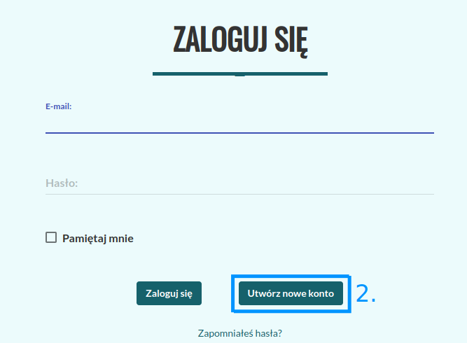
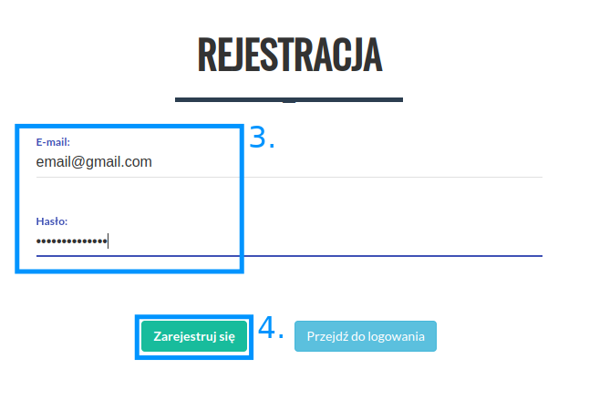

Tworzenie konta
===============
| Korzystanie z Korpusomatu należy rozpocząć od rejestracji, czyli założenia konta użytkownika,
| w ramach którego będzie można zarządzać tworzonymi korpusami. Do założenia konta wystarczy
| podanie adresu e-mail i hasła użytkownika.

Konto można stworzyć klikając w
przycisk „Login/Rejestracja” w menu, w prawym górnym rogu.

|

|image1|

--------------

|image2|

--------------

|image3|

--------------

