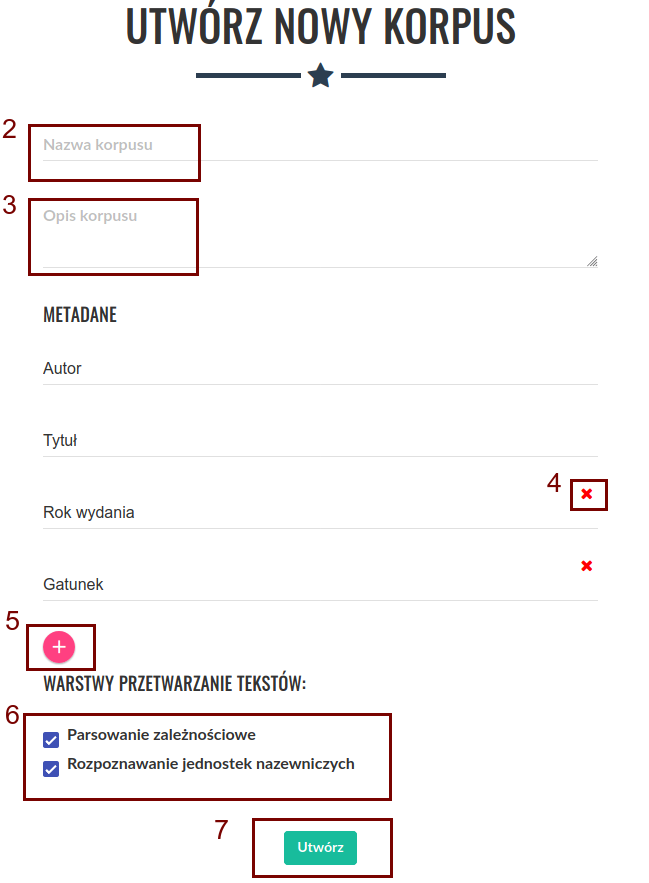
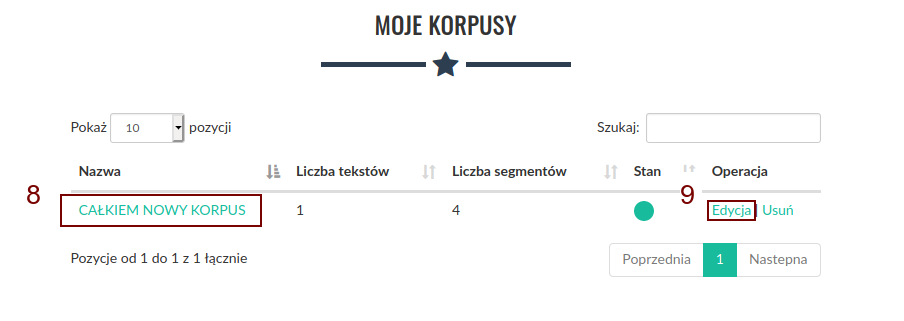
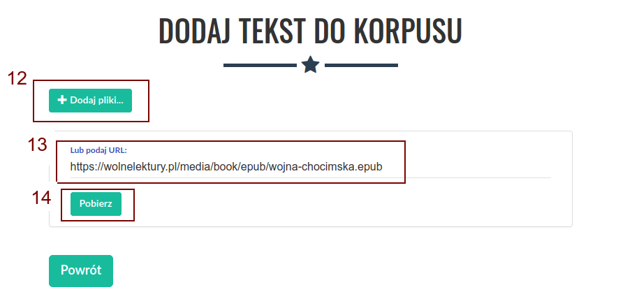
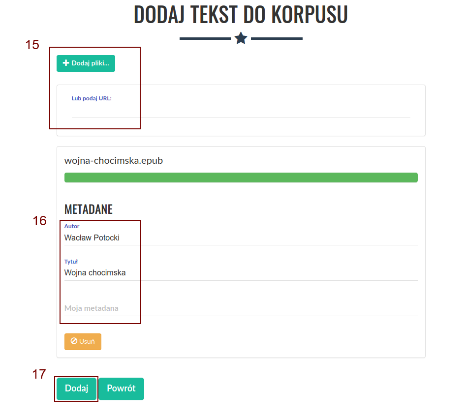
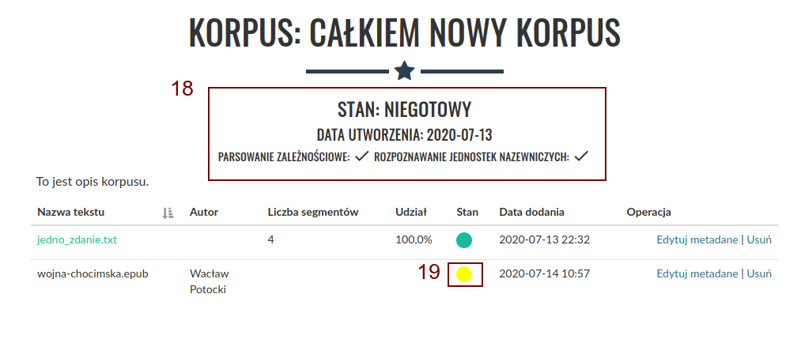
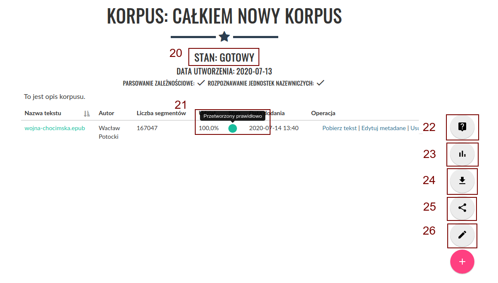

Tworzenie korpusu
=================

Aby utworzyć nowy korpus (po uprzednim zalogowaniu
się), należy kliknąć odnośnik „Nowy korpus” (1) z
górnego menu.

|image1|

--------------

Następnie należy wybrać nazwę dla korpusu (2) oraz
warstwy przetwarzania tekstów (6). W tym miejscu można
też dodawać (5) i usuwać (4) nowe metadane dla
wszystkich tekstów w korpusie. Autor i Tytuł to
metadane obowiązkowe. Dodatkowo można dodać opis
korpusu (3). Aby zapisać korpus, należy kliknąć
przycisk „Utwórz” (7).

|image2|

--------------

Po utworzeniu korpusu zostaniemy przeniesieni do
ekranu „Moje korpusy językowe”. Aby rozpocząć
dodawanie tekstów do nowo utworzonego korpusu, należy
kliknąć jego nazwę (8) na liście korpusów. Na tym
ekranie wyświetlane są także dodatkowe informacje o
korpusach, jest tu również możliwość usunięcia
niepotrzebnego korpusu oraz edycji istniejących
korpusów (9, 10).

|image3|

--------------

Aby dodać nowy tekst do korpusu, należy następnie
kliknąć ikonę „+” (11) w prawym dolnym rogu ekranu.

|image4|

--------------

Po kliknięciu zostaniemy przeniesieni do ekranu
dodawania tekstu. Lista dozwolonych formatów znajduje
się `tutaj <https://korpusomat.pl/overview>`__. Dodać
teksty możemy na dwa sposoby.

Pierwszym jest kliknięcie górnego przycisku „+ Dodaj
pliki” (12), który pozwala na dodawanie plików z
lokalnego dysku. Po kliknięciu pojawi się okno wyboru
plików, w którym możemy wskazać jeden lub wiele plików
jednocześnie do dodania do korpusu.

Drugim sposobem jest podanie bezpośrednio linku do
tekstu w polu tekstowym „Lub podaj URL:” (13), a
następnie kliknięcie przycisku „Pobierz” (14).
Korpusomat pobierze wtedy plik automatycznie i
przetworzy go. W takim przypadku możliwe jest również
podanie linku do artykułu (np z portalu
internetowego), z którego zostanie wydobyta treść i
przetworzona do pliku txt.

|image5|

--------------

Po przetworzeniu wybranych tekstów istnieje możliwość
edycji metadanych (16) lub dodania kolejnych tekstów
(15). Korpusomat automatycznie próbuje uzyskać
metadane z dodanego pliku, jednak nie zawsze jest to
możliwe. Automatyczne rozpoznawanie metadanych
zakłada, że nazwy plików są w następującym formacie:
„autor - tytuł (miejsce, rok)”. Przykładowo, aby
Korpusomat automatycznie rozpoznał metadane Pana
Tadeusza z nazwy pliku, dodany plik powinien nazywać
się „Adam Mickiewicz - Pan Tadeusz (Paryż, 1834).txt”.
Powyższe dotyczy plików w formatach, które nie
zawierają odpowiednich pól przechowujących metadane —
nie dotyczy np. plików epub, z których metadane
zostaną wyciągnięte wprost z pliku, a nie z jego
nazwy.

Przed zatwierdzeniem istnieje możliwość ręcznej edycji
metadanych.

Do dodawania kolejnych tekstów służą przyciski na
górze (15). Metoda dodawania jest identyczna jak w
przypadku pierwszego tekstu.

Gdy wszystkie teksty są już dodane, a ich metadane są
poprawnie ustawione, należy kliknąć przycisk „Dodaj”
(17) na dole ekranu, aby dodać wybrane teksty do
korpusu.

|image6|

--------------

Po dodaniu tekstów zostaniemy przeniesieni do ekranu
korpusu, a Korpusomat zacznie przetwarzanie tekstów w
wybranych warstwach anotacji. Przy nazwie korpusu
pojawi się stan korpusu, data jego utworzenia oraz
informacje o warstwach przetwarzania tekstów (18).
Przy każdym z tekstów będzie wyświetlony status
przetwarzania (19). Podczas analizy będzie to „Trwa
przetwarzanie”. Czas przetwarzania przeciętnej
wielkości książki o objętości ok. 80-100 tys. słów
powinien wynieść około 4-5 minut, choć zależy to
również od aktualnego obciążenia serwera oraz
wybranych warstw anotacji. Obecnie maksymalny czas
przetwarzania jednego pliku wynosi 10 minut – zadania
dłuższe zakończą się niepowodzeniem. Podczas
przetwarzania tekstów można nadal dodawać następne
teksty za pomocą przycisku (11).

|image7|

--------------

Gdy wszystkie teksty zostaną przetworzone, a ich
status zostanie oznaczony jako „Przetworzony
prawidłowo” (21), status całego korpusu zostanie
również automatycznie zaktualizowany do wartości
„Gotowy” (20). Na tym etapie zostaną odblokowane
przyciski u dołu ekranu i będzie można przystąpić do
dalszej pracy z korpusem. Możliwe dalsze czynności to:

-  Przeszukiwanie korpusu — przycisk (22)
-  Podsumowanie statystyczne korpusu — przycisk (23)
-  Pobieranie przetworzonych plików XML — przycisk
   (24)
-  Udostępnienie korpusu innym użytkownikom (25)
-  Edycja korpusu (26)

Kliknięcie przycisku (23) spowoduje przeniesienie do
ekranu podsumowania statystycznego oraz rozpoczęcie
ich generowania. Opis poszczególnych części
podsumowania znajduje się
`tutaj <https://korpusomat.pl/statistics_manual>`__.

Kliknięcie przycisku (24) spowoduje pobranie archiwum
z przetworzonymi plikami XML tekstów w korpusie. Pliki
te są w formacie zgodnym ze specyfikacją
`CCL <http://www.nlp.pwr.wroc.pl/redmine/projects/corpus2/wiki/CCL_format>`__.

|image8|

--------------

Na tym etapie nadal można edytować korpus. Dodawanie
oraz usuwanie tekstów spowoduje automatyczne
uruchomienie procesu przetwarzania, po zakończeniu
którego korpus z powrotem otrzyma status „Gotowy”.

