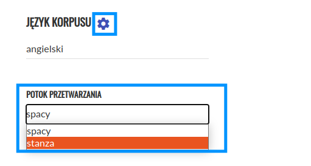

Tworzenie korpusu
=================

Aby utworzyć nowy korpus, należy kliknąć „Nowy korpus” w menu głównym.

|image4|

--------------

Następnie należy wprowadzić nazwę i opis korpusu (6) oraz
wybrać język korpusu (7).

|image5|
|image19|

--------------

Po naciśnięciu ikony ustawień obok pola (7) możliwe jest wybranie preferowanego potoku przetwarzania.
Jeśli dla danego języka dostępne są oba potoki przetwarzania, domyślnym potokiem jest Spacy.
W polach (8) można wprowadzić metadane dla wszystkich tekstów w korpusie
(możliwe jest ich zmodyfikowanie po utworzeniu korpusu). Aby zapisać korpus, należy kliknąć
przycisk „Utwórz” (9).

|image6|

--------------

Użytkownik zostanie przekierowany do widoku utworzonego korpusu. Po zmianie stanu korpusu na „Gotowy” (10)
można dodać pierwszy tekst za pomocą przycisku „+” (11).

|image7|

--------------

Po kliknięciu nastąpi przekierowanie do ekranu dodawania tekstu. Lista dozwolonych formatów znajduje
się `tutaj <https://korpusomat.pl/overview>`__. Teksty można dodać na dwa sposoby.

|image8|

--------------

Pierwszym jest kliknięcie przycisku „+ Dodaj pliki” (16), który pozwala na dodawanie plików
z lokalnego dysku. Po kliknięciu pojawi się okno wyboru plików, w którym można wskazać jeden
lub wiele plików jednocześnie. Drugim sposobem jest podanie bezpośrednio linku do tekstu w polu tekstowym 
„Lub podaj URL:” (17), a
następnie kliknięcie przycisku „Pobierz” (18).
Korpusomat pobierze wtedy plik automatycznie i przetworzy go. W takim wypadku możliwe jest również
podanie linku do artykułu (np. z portalu
internetowego), z którego zostanie wydobyta treść i przetworzona do pliku tekstowego. 

Po załadowaniu treści można wprowadzić lub zmodyfikować metadane (19). Korpusomat automatycznie
spróbuje wydobyć metadane z dodanego pliku, jednak nie
zawsze jest to możliwe. W wypadku tekstów w formatach EPUB i MOBI oraz stron internetowych Korpusomat spróbuje wydobyć metadany z nagłówków dokumentów. W wypadku plików tekstowych automatyczne rozpoznawanie metadanych wymaga tego, by nazwy plików zapisane były w następującym formacie:
„autor - tytuł (miejsce, rok)”. Przykładowo, aby
Korpusomat automatycznie rozpoznał metadane „Pana Tadeusza” z nazwy pliku, dodany plik powinien nazywać
się „Adam Mickiewicz - Pan Tadeusz (Paryż, 1834).txt”.

Aby dodać więcej tekstów, należy ponownie użyć przycisku „+ Dodaj pliki…” (16), czy  pola
„Lub podaj URL” (17).

|image9|

Aby przejść dalej, należy kliknąć przycisk „Dodaj” (20).

--------------

Po dodaniu tekstów zostaniemy przeniesieni do ekranu korpusu, a Korpusomat 
zacznie przetwarzać teksty. Przy nazwie korpusu pojawi się informacja o stanie jego przetwarzania oraz 
data jego utworzenia (21).
Przy każdym z tekstów będzie wyświetlony status przetwarzania (22). Podczas analizy będzie to „Trwa przetwarzanie” (22). 
Przetworzanie książki o objętości ok. 80-100 tys. słów powinno potrwać około 4-5 minut, choć zależy to również od aktualnego obciążenia serwera oraz
wybranych warstw znakowania. Obecnie maksymalny czas przetwarzania jednego pliku wynosi 10 minut – zadania
dłuższe zakończą się niepowodzeniem. Podczas przetwarzania tekstów można nadal dodawać kolejne
teksty za pomocą przycisku (11).

|image10|

--------------

Gdy wszystkie teksty zostaną przetworzone a ich status zostanie oznaczony jako „Przetworzony prawidłowo”, 
status całego korpusu zostanie również automatycznie zmieniony na „Gotowy” (23).

|image11|

--------------

Na tym etapie będzie można przystąpić do dalszej pracy z korpusem. Możliwe dalsze czynności to:

 1. Edycja korpusu (12)
 2. Udostępnienie korpusu innym użytkownikom (13)
 3. Pobieranie przetworzonych plików XML — przycisk (14)
 4. Przeszukiwanie korpusu (15)

Ad 1.
Po wciśnięciu przycisku (12) możliwa jest edycja nazwy i opisu korpusu,
a także dodanie lub zmiana metadanych (25).

|image12|

--------------

Ad 2.
Po wciśnięciu przycisku (13) możliwe jest udostępnienie utworzonego
korpusu innym użytkownikom Korpusomatu. W polu (26) należy wpisać
adres email użytkownika, któremu udostępnia się utworzony korpus,
następnie wybiera się rodzaj dostępu jaki ma być przydzielony (27).
Po zatwierdzeniu zmian przyciskiem „Dodaj” (28) nowy użytkownik korpusu
zostaje dodany. Możemy go usunąć przyciskiem (29). W celu udostępnienia
korpusu wszystkim użytkownikom Korpusomatu należy przełączyć przycisk (30).

|image13|

--------------

Ad 3.
Kliknięcie przycisku (14) spowoduje pobranie archiwum
z przetworzonymi plikami XML tekstów w korpusie. Pliki
te są w formacie zgodnym ze specyfikacją
`CCL <http://www.nlp.pwr.wroc.pl/redmine/projects/corpus2/wiki/CCL_format>`__.

Na tym etapie nadal można edytować korpus. Dodawanie
oraz usuwanie tekstów spowoduje automatyczne
uruchomienie procesu przetwarzania, po zakończeniu
którego korpus z powrotem otrzyma status „Gotowy”.

Ad 4.
Kliknięcie przycisku (15) spowoduje przeniesienie do ekranu wyszukiwania.
Sposób tworzenia zapytań został opisany w dalszej części instrukcji.

.. |image4| image:: ../img/new_img/4.png
   :class: center-block
.. |image5| image:: ../img/new_img/5.png
   :class: center-block
.. |image6| image:: ../img/new_img/6.png
   :class: center-block
.. |image7| image:: ../img/new_img/7.png
   :class: center-block
.. |image8| image:: ../img/new_img/8.png
   :class: center-block
.. |image9| image:: ../img/new_img/9.png
   :class: center-block
.. |image10| image:: ../img/new_img/10.png
   :class: center-block
.. |image11| image:: ../img/new_img/11.png
   :class: center-block
.. |image12| image:: ../img/new_img/12.png
   :class: center-block
.. |image13| image:: ../img/new_img/13.png
   :class: center-block

