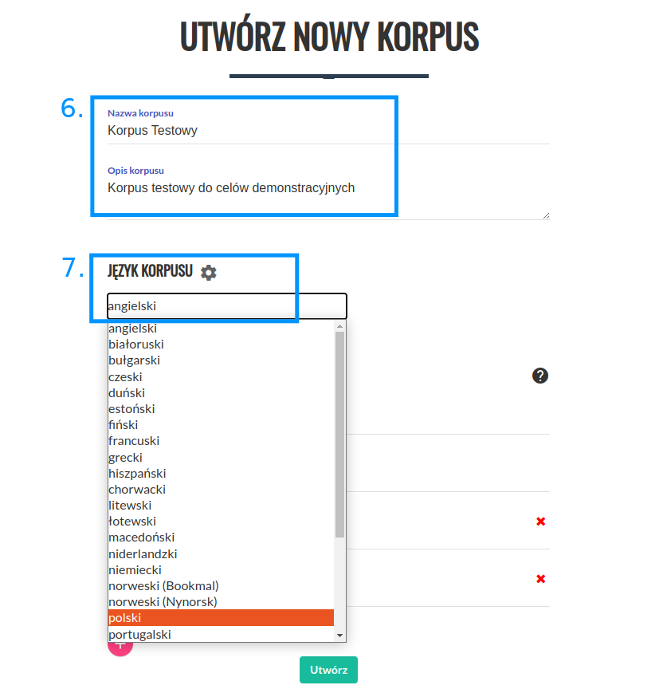
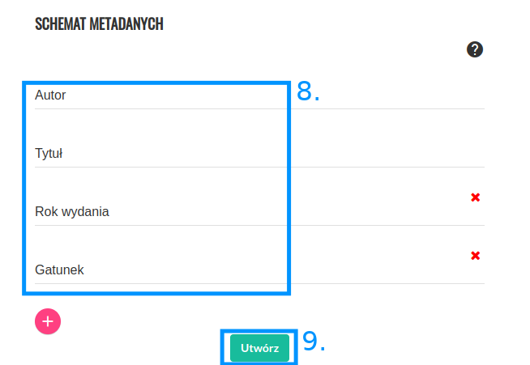
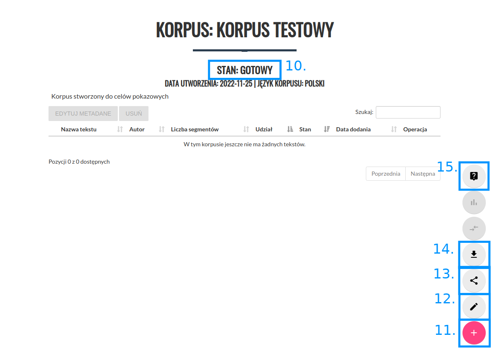
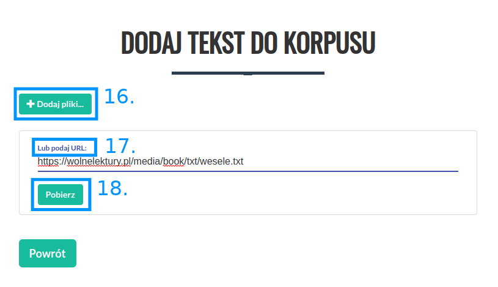
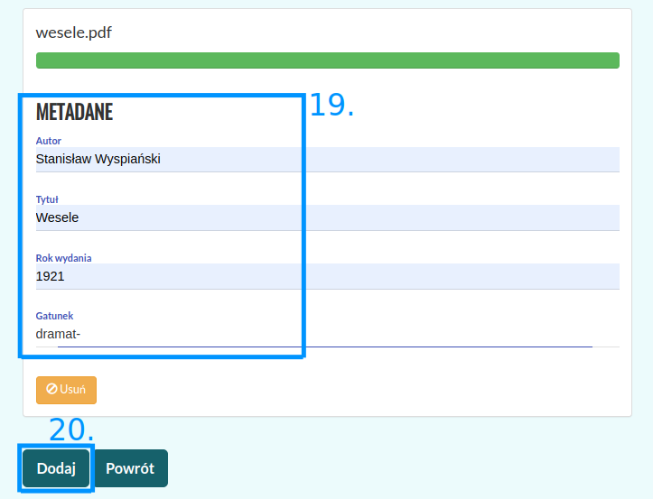
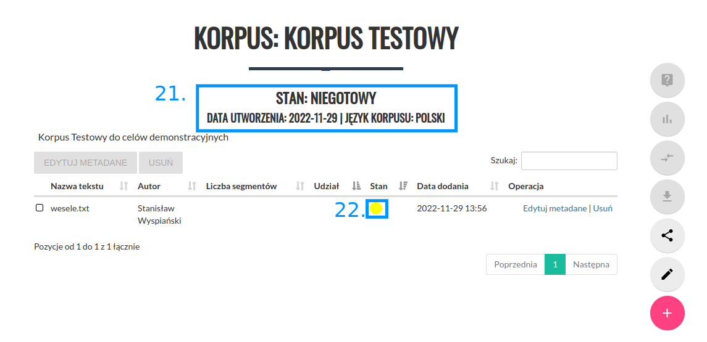
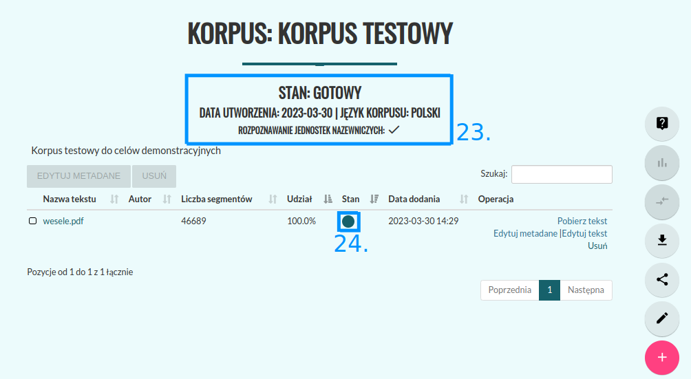
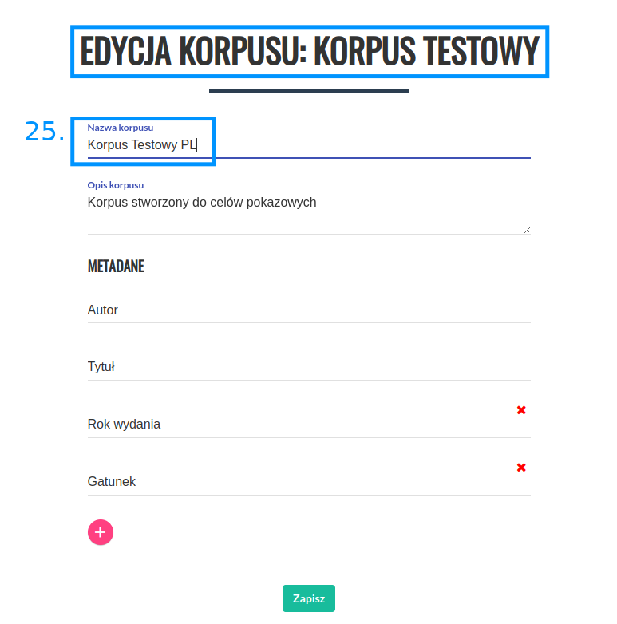
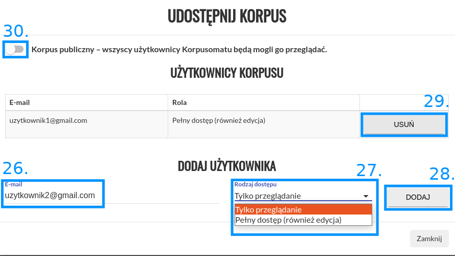

Tworzenie korpusu
=================

Aby utworzyć nowy korpus należy kliknąć "NOWY KORPUS" z menu.

|image4|

--------------

Następnie należy wprowadzić nazwę i opis korpusu (6) oraz
wybrać język korpusu (7).

|image5|

--------------

W (8) można wprowadzić metadane dla wszystkich tekstów w korpusie
(edytcja po utworzeniu korpusu jest możliwa). Aby zapisać korpus należy kliknąć
przycisk „Utwórz” (9).

|image6|

--------------

Na tym etapie nastąpi przekierowanie do widoku
utworzonego korpusu. Po przejściu stanu korpusu na „GOTOWY” (10)
można dodać pierwszy tekst przyciskiem „+” (11).

|image7|

--------------

Po kliknięciu nastąpi przekierowanie do ekranu
dodawania tekstu. Lista dozwolonych formatów znajduje
się `tutaj <https://korpusomat.pl/overview>`__. Dodać
teksty możemy na dwa sposoby.

|image8|

--------------

| Pierwszym jest kliknięcie przycisku „+ Dodaj pliki” (16), który pozwala na dodawanie plików
| z lokalnego dysku. Po kliknięciu pojawi się okno wyboru plików, w którym możemy wskazać jeden
| lub wiele plików jednocześnie do dodania do korpusu.

Drugim sposobem jest podanie bezpośrednio linku do
tekstu w polu tekstowym „Lub podaj URL:” (17), a
następnie kliknięcie przycisku „Pobierz” (18).
Korpusomat pobierze wtedy plik automatycznie i
przetworzy go. W takim wypadku możliwe jest również
podanie linku do artykułu (np. z portalu
internetowego), z którego zostanie wydobyta treść i
przetworzona do pliku txt. Po załadowaniu się treści
można podać/ edytować metadane (19). Korpusomat automatycznie
próbuje uzyskać metadane z dodanego pliku, jednak nie
zawsze jest to możliwe. Automatyczne rozpoznawanie metadanych
zakłada, że nazwy plików są w następującym formacie:
„autor - tytuł (miejsce, rok)”. Przykładowo, aby
Korpusomat automatycznie rozpoznał metadane Pana
Tadeusza z nazwy pliku, dodany plik powinien nazywać
się „Adam Mickiewicz - Pan Tadeusz (Paryż, 1834).txt”.
Powyższe dotyczy plików w formatach, które nie
zawierają odpowiednich pól przechowujących metadane —
nie dotyczy np. plików epub, z których metadane
zostaną wyciągnięte wprost z pliku, a nie z jego
nazwy.

Aby dodać więcej tekstów należy
ponownie użyć przycisku „+ Dodaj pliki...” (16), czy  pola
„lub podaj URL” (17).

|image9|

Aby przejść dalej należy kliknąć przycisk „DODAJ” (20).

--------------

Po dodaniu tekstów zostaniemy przeniesieni do ekranu
korpusu, a Korpusomat zacznie przetwarzanie tekstów w
wybranych warstwach anotacji. Przy nazwie korpusu
pojawi się stan korpusu, data jego utworzenia oraz
informacje o warstwach przetwarzania tekstów (21).
Przy każdym z tekstów będzie wyświetlony status
przetwarzania (22). Podczas analizy będzie to „Trwa przetwarzanie” -
po najechaniu myszką na żółtą kropkę (22). Czas przetwarzania przeciętnej
wielkości książki o objętości
ok. 80-100 tys. słów powinien wynieść około 4-5 minut,
choć zależy to również od aktualnego obciążenia serwera oraz
wybranych warstw anotacji. Obecnie maksymalny czas
przetwarzania jednego pliku wynosi 10 minut – zadania
dłuższe zakończą się niepowodzeniem. Podczas
przetwarzania tekstów można nadal dodawać następne
teksty za pomocą przycisku (11).

|image10|

--------------

Gdy wszystkie teksty zostaną przetworzone, a ich
status zostanie oznaczony jako „Przetworzony prawidłowo” (po najechaniu myszką na zieloną kropkę (24))
- status całego korpusu zostanie również automatycznie zaktualizowany do wartości
„Gotowy” (23).

|image11|

--------------

Na tym etapie będzie można przystąpić do
dalszej pracy z korpusem. Możliwe dalsze czynności to:

 1.   Edycja korpusu (12)
 2.  Udostępnienie korpusu innym użytkownikom (13)
 3. Pobieranie przetworzonych plików XML — przycisk (14)
 4.   Przeszukiwanie korpusu — przycisk (15)

Ad 1.
Po wciśnięciu przycisku (12) możliwa jest edycja nazwy i opisu korpusu,
a także dodawanie/ zmiana metadanych (25).

|image12|

--------------

Ad 2.
Po wciśnięciu przycisku (13) możliwe jest udostępnienie utworzonego
korpusu innym użytkownikom Korpusomatu. W polu (26) należy wpisać
adres email użytkownika, któremu udostępnia się utworzony korpus,
następnie wybiera się rodzaj dostępu jaki ma być przydzielony (27).
Po zatwierdzeniu zmian przyciskiem „DODAJ” (28) nowy użytkownik korpusu
zostaje dodany. Możemy go usunąć przyciskniem (29). W celu udostępnienia
korpusu wszystkim użytkownikom Korpusomatu należy przełączyć przycisk (30).

|image13|

--------------

Ad 3.
Kliknięcie przycisku (14) spowoduje pobranie archiwum
z przetworzonymi plikami XML tekstów w korpusie. Pliki
te są w formacie zgodnym ze specyfikacją
`CCL <http://www.nlp.pwr.wroc.pl/redmine/projects/corpus2/wiki/CCL_format>`__.

Na tym etapie nadal można edytować korpus. Dodawanie
oraz usuwanie tekstów spowoduje automatyczne
uruchomienie procesu przetwarzania, po zakończeniu
którego korpus z powrotem otrzyma status „Gotowy”.

Ad 4.
Kliknięcie przycisku (15) spowoduje przeniesienie do ekranu wyszukiwania.
Sposób tworzenia zapytań został opisany w dalszej części instrukcji.

