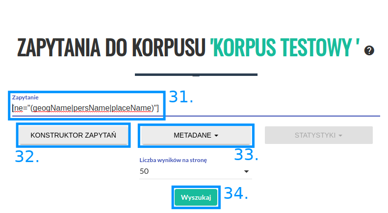
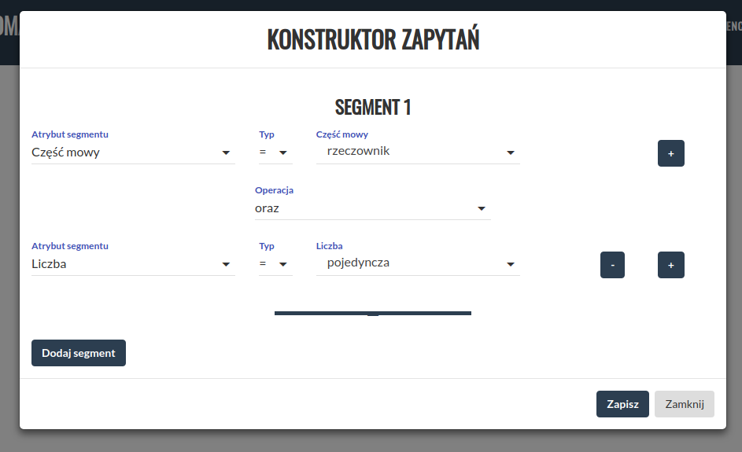
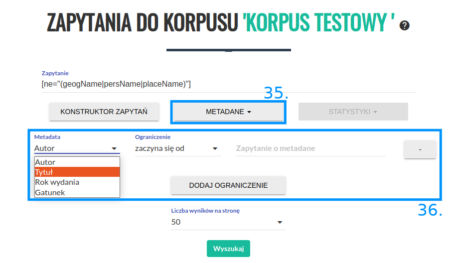
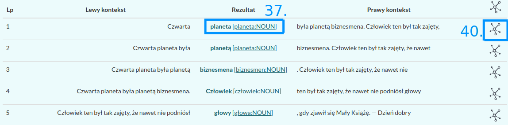
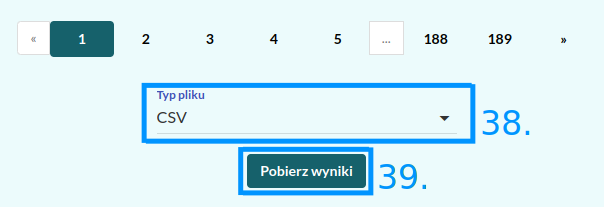
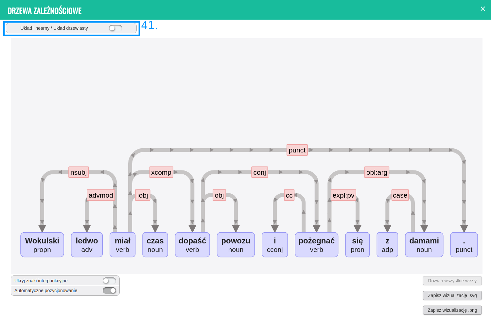
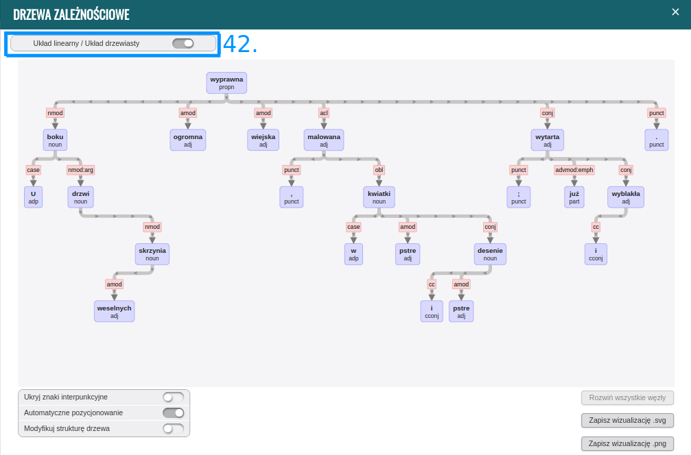
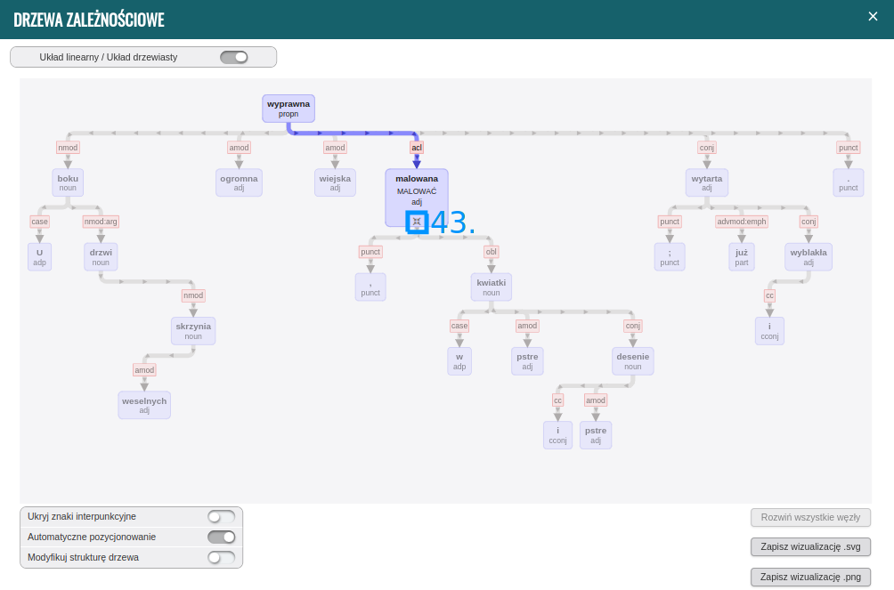
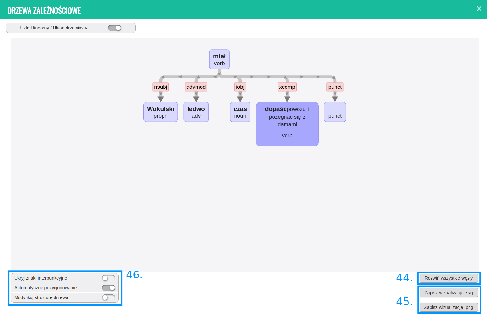

Wyszukiwanie w korpusie
=======================

W polu „Zapytanie” (31) należy
wpisać zapytanie, które chcemy wykonać, a następnie
wcisnąć przycisk „Wyszukaj” (34). Opis języka zapytań
dostępny jest w 
`kolejnej części instrukcji <https://korpusomat.readthedocs.io/pl/latest/mtas.html>`__.
Przycisk (32) uruchamia graficzny konstruktor zapytań.
Przycisk (33) rozwija menu ograniczenia wyszukiwania
do tekstów o konkretnych metadanych.

|image14|

--------------

Kliknięcie przycisku (32) spowoduje otwarcie ekranu
konstruktora zapytań. Pozwala on na zbudowanie
interesującego zapytania poprzez wybranie cech
segmentów z rozwijanych list. Po wybraniu wszystkich cech należy kliknąć
przycisk „Zapisz”, aby powrócić do ekranu
wyszukiwania. W polu zapytanie pojawi się zapytanie przetworzone na język
zapytań wyszukiwarki (CQL – Corpus Query Language).

|image15|

--------------

Kliknięcie przycisku (35) spowoduje rozwinięcie menu
metadanych (36). Można tutaj ograniczyć wyniki
wyszukiwania jedynie do tekstów, które spełniają
określone kryteria.

|image16|

--------------

Po wykonaniu zapytania użytkownik zostanie przeniesiony do
strony z wynikami w postaci konkordancji. Szerszy kontekst znalezionego wyrazu lub wyrażenia oraz metadane tekstu, z którego pochodzi, można obejrzeć, klikając na niego (37). Aby pobrać całą listę wyników w formie pliku CSV lub XLS, należy wybrać typ
pliku (38) i wcisnąć przycisk „Pobierz wyniki” (39).

|image25|
|image20|

--------------

Po kliknięciu ikony (40) użytkownik zostaje przekierowany do strony
z wizualizacją drzew zależnościowych. Wizualizacji podlega pełne wypowiedzenie,
zawierające konkretny przykład wyszukanych rezultatów zapytania.
Użytkownik może się przełączać między dwoma układami: linearnym (41), bądź drzewiastym (42).

|image21|
|image22|

--------------

Użytkownik może zwinąć wybrane węzły. W tym celu należy najechać
myszą na wybrany węzeł i kliknąć ikonę (43). W ten sam sposób można rozwinąć zwinięty 
wcześniej węzeł lub użyć przycisku (44), który rozwinie wszystkie węzły w drzewie.

|image23|

--------------

Wizualizację drzewa można zapisać w formacie SVG lub PNG (45).
w polach (46) dostępne są dodatkowe opcje:

-   ukrycia znaków interpunkcyjnych w analizowanym zdaniu dla zwiększenia jego czytelności,

-   automatycznego pozycjonowania drzewa (po wybraniu tego przcisku
    analizowane drzewo zostanie usytuowane w centralnej
    części okna modalnego),
    
-   modyfikacji struktury drzewa (poszczególne węzły można przesuwać w obrębie drzewa).

|image24|

--------------

