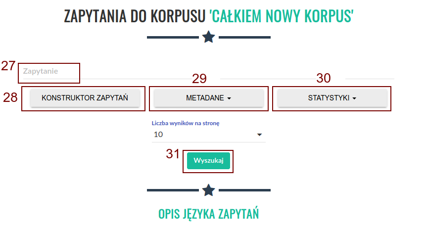
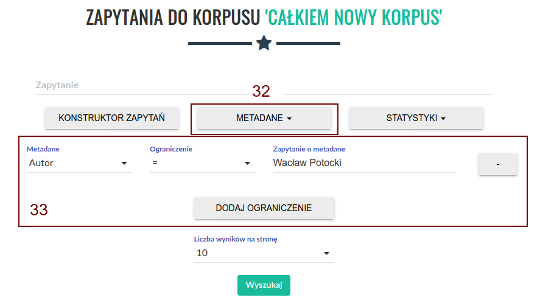
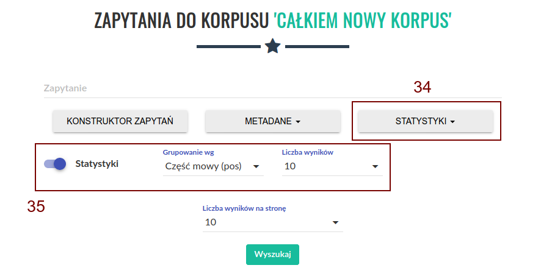
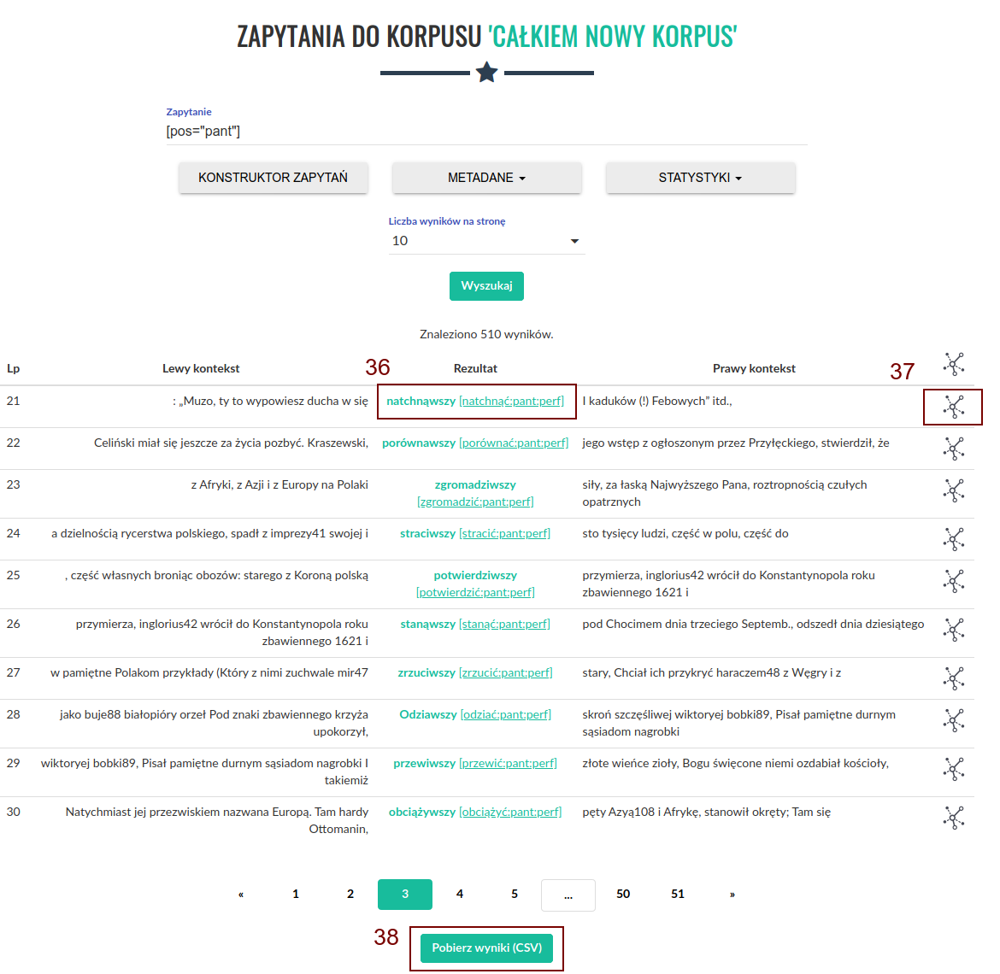

Wyszukiwanie w korpusie
=======================

Kliknięcie przycisku (22) spowoduje przeniesienie do
ekranu wyszukiwania. W polu „Zapytanie” (27) należy
wpisać zapytanie, które chcemy wykonać, a następnie
wcisnąć przycisk „Wyszukaj” (31). Opis języka zapytań
dostępny jest w 
`kolejnej części instrukcji <https://korpusomat.readthedocs.io/en/latest/mtas.html>`__.
Przycisk (28) uruchamia graficzny konstruktor zapytań.
Przycisk (29) rozwija menu ograniczenia wyszukiwania
do tekstów o konkretnych metadanych. Przycisk (30)
pozwala na wygenerowanie z wyników zapytania prostej
listy frekwencyjnej w oparciu o wybrane kryterium.

|image9|

--------------

Kliknięcie przycisku (28) spowoduje otwarcie ekranu
konstruktora zapytań. Pozwala on na zbudowanie
interesującego zapytania poprzez wybranie cech
segmentów z rozwijanych list. Należy jednak pamiętać,
że konstruktor jest ograniczony jedynie do anotacji
fleksyjnej. Po wybraniu wszystkich cech należy kliknąć
przycisk „Zapisz”, aby powrócić do ekranu
wyszukiwania. W polu zapytanie pojawi się wtedy
interesujące nas zapytanie przetworzone na język
zapytań wyszukiwarki.

|image10|

--------------

Kliknięcie przycisku (32) spowoduje rozwinięcie menu
metadanych (33). Możemy tutaj ograniczyć wyniki
wyszukiwania jedynie do tekstów, które spełniają
wyspecyfikowane kryteria.

|image11|

--------------

Kliknięcie przycisku (34) spowoduje rozwinięcie menu
statystyk (35). Możemy tutaj dołączyć do wyników
wyszukiwania pewne proste dane frekwencyjne.
Przykładowo, możemy wyświetlić listę frekwencyjną
wyników według konkretnego atrybutu segmentu lub
wykres pokazujący rozkład wyników ze względu na
wybrane metadane.

|image12|

--------------

Po wykonaniu zapytania zostaniemy przeniesieni do
strony z wynikami, które możemy przeglądać. Możemy też
wyświetlić dodatkowe informacje o kontekście
znalezionego wyniku, klikając na niego (36), lub
pobrać całą listę wyników w formie csv (37). Aby
wyświetlić wizualizację rozbiorów składniowych
wypowiedzień w korpusach, w których opcja
przetwarzania zależnościowego została zaznaczona,
należy kliknąć w ikonę po prawej stronie tabeli (37).

|image13|

--------------

.. |image10| image:: ../img/instrukcja/10.png
   :class: center-block

