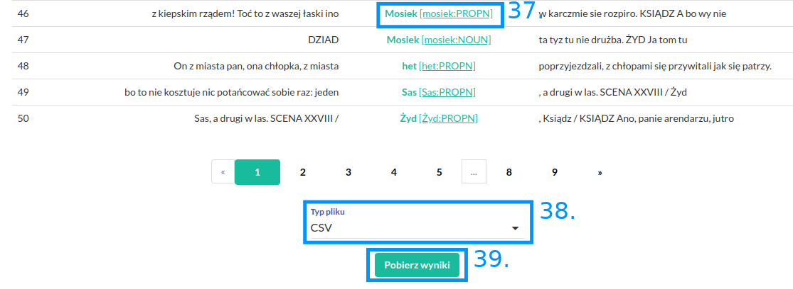

Wyszukiwanie w korpusie
=======================

W polu „Zapytanie” (31) należy
wpisać zapytanie, które chcemy wykonać, a następnie
wcisnąć przycisk „Wyszukaj” (34). Opis języka zapytań
dostępny jest w 
`kolejnej części instrukcji <https://korpusomat.readthedocs.io/pl/latest/mtas.html>`__.
Przycisk (32) uruchamia graficzny konstruktor zapytań.
Przycisk (33) rozwija menu ograniczenia wyszukiwania
do tekstów o konkretnych metadanych.

|image14|

--------------

Kliknięcie przycisku (32) spowoduje otwarcie ekranu
konstruktora zapytań. Pozwala on na zbudowanie
interesującego zapytania poprzez wybranie cech
segmentów z rozwijanych list. Należy jednak pamiętać,
że konstruktor jest ograniczony jedynie do anotacji
fleksyjnej. Po wybraniu wszystkich cech należy kliknąć
przycisk „Zapisz”, aby powrócić do ekranu
wyszukiwania. W polu zapytanie pojawi się wtedy
interesujące nas zapytanie przetworzone na język
zapytań wyszukiwarki.

|image15|

--------------

Kliknięcie przycisku (35) spowoduje rozwinięcie menu
metadanych (36). Możemy tutaj ograniczyć wyniki
wyszukiwania jedynie do tekstów, które spełniają
wyspecyfikowane kryteria.

|image16|

--------------

Po wykonaniu zapytania zostaniemy przeniesieni do
strony z wynikami, które możemy przeglądać. Możemy też
wyświetlić dodatkowe informacje o kontekście
znalezionego wyniku, klikając na niego (37). Aby pobrać
całą listę wyników w formie csv lub XLS należy wybrać typ
pliku (38) i wcisnąć przycisk „Pobierz wyniki” (39).

|image17|

--------------

.. |image14| image:: ../img/new_img/14.png
   :class: center-block
.. |image15| image:: ../img/new_img/15.png
   :class: center-block
.. |image16| image:: ../img/new_img/16.png
   :class: center-block

