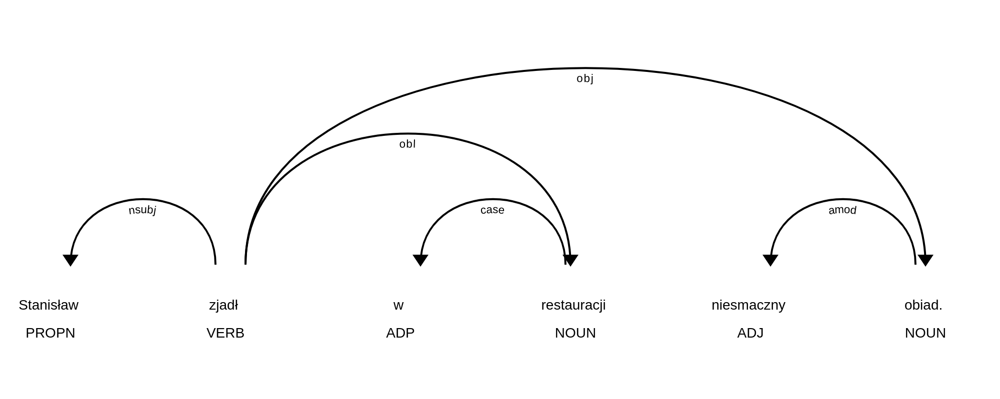

Tworzenie zapytań do korpusu
^^^^^^^^^^^^^^^^^^^^^^^^^^^^

Niniejsza część instrukcji opisuje język zapytań CQL w odniesieniu do warstw znakowania dostępnych w Korpusomacie.

Segmentacja
===========

Znaczniki morfosyntaktyczne, tzw. tagi, przypisane są segmentom
(tokenom, w przybliżeniu słowom). Segmenty nie są dłuższe niż słowa
ortograficzne (słowa ‘od spacji do spacji’ z oddzieleniem znaków interpunkcyjnych), ale w niektórych wypadkach
segmenty mogą być krótsze niż takie słowa. Szczegółowe zasady segmentacji dla poszczególnych języków mogą się różnić i zależą od decyzji podjętych przez twórców zasobów jezykowych dla danego języka (głównie twórców banków drzew zależnościowych) oraz przez twórców konkretnych narzędzi programistycznych. Przykładowo, w korpusach języka polskiego (w tym m.in. w Narodowym Korpusie Języka Polskiego) na etapie segmentacji zwykło się oddzielać od form przeszłych czasowników tzw. aglutynant (wykładnik osoby i liczby) a także partykułę *by* będącą wykładnikiem trybu warunkowego. W efekcie słowo jedno słowo tekstowe zostaje rozbite odpowiednio na dwa lub trzy segmenty i każdemu z nich jest przypisana osobna interpretacja fleksyjna: np. *[pisał][eś]*, *[jedli][by][śmy]*. Jednak w Korpusomacie ta decyzja jest dodatkowo zależna od wybranego potoku przetwarzania, bowiem twórcy tych potoków podjęli w tej sprawie różne decyzje: Stanza stosuje segmentację taką, jak w Narodowym Korpusie Języka Polskiego, czyli oddziela aglutynant i partykułę *by*, ale spaCy uznaje formy czasu przeszłego oraz trybu warunkowego za pojedyncze segmenty i nie rozbija ich. To jednak rzadkie i skrajne przypadki wynikające ze specyfiki wykorzystanych narzędzi — w większości wypadków teksty w poszczególnych językach powinny być segmentowane w obu potokach tak samo i zgodnie z typową dla danego języka segmentacją stosowaną w bankach drzew składniowych oraz korpusach narodowych danych języków.

Znaczniki morfosyntaktyczne
=====================================

Wszystkie korpusy w Korpusomacie zawierają warstwę informacji morfosyntaktycznej zgodną ze specyfikacją Universal Dependencies. Informacja ta jest rozdzielona na dwie składowe: oznaczenie części mowy (tzw. UPOS — *universal part of speech*) oraz cechy morfosyntaktyczne (tzw. UFEATS — *universal features*). Obie te składowe (nazwy części mowy, nazwy cech morfoskładniowych i listy ich możliwych wartości) są opisane w dokumentacji `na stronie projektu UD <https://universaldependencies.org/guidelines.html>`__. Ponieważ z zasady jest to opis uniwersalny, każdy z konkretnych języków korzysta tylko z podzbioru cech morfologicznych i ich wartości. 

Oprócz informacji morfosyntaktycznej zgodnej ze specyfikacją UD w większości korpusów dostępny jest również dodatkowy znacznik, tzn. XPOS, który przechowuje informację morfosyntaktyczną zgodną z tagsetem stosowanym w zasobach dla danego języka. Oba potoki przetwarzania dostarczają znakują teksty również znacznikami XPOS, ale ich konkretna postać zależy zarówno od twórców narzędzi, jak i twórców banku drzew UD. W szczególności od twórców banku drzew zależy, jaka postać znacznika znajdzie się w polu XPOS — zarówno pod względem szczegółowości opisu morfosyntaktycznego, jak i technicznego opisu samego tagsetu, dlatego nie mają one ustandaryzowanej wspólnej postaci. Najczęściej są to jednak systemy znaczników stosowane w narodowych korpusach tych języków. W wypadku gdy twórcy banku drzew UD nie umieścili w nim znaczników XPOS, Korpusomat również nie umożliwa korzystania z nich — tak jest wypadku języka rosyjskiego (w obu potokach przetwarzania). W niektórych wypadkach postać znacznika XPOS może się różnić w zależności od potoku przetwarzania, np. w wypadku języka polskiego Stanza zwraca pełne znaczniki morfosyntaktyczne (w tagsecie stosowanym w polskich korpusach), spaCy zaś ogranicza się tylko do pierwszej części takiego znacznika oznaczającej przynależność słowa do klasy gramatycznej.

Język zapytań
=============

Składnia zapytań w programie MTAS została oparta na języku zapytań
o nazwie Corpus Query Language (CQL), który jest powszechnie znany i stosowany w wyszukiwarkach korpusowych. 
Niniejszy rozdział omawia składnię CQL w wariancie zastowanych w Korpusomacie.

MTAS jest uniwersalną wyszukiwarką pozwalającą na przeszukiwanie
korpusów zawierających wiele warstw anotacyjnych. Niniejsza instrukcja dotyczy przeszukiwania korpusów 
postaci indeksowanej przez Korpusomat, który tworzy
aktualnie trzy warstwy znakowania: warstwę morfosyntaktyczną
i składniową oraz warstwę jednostek nazewniczych. Ogólna podstawowa dokumentacja 
wyszukiwarki MTAS znajduje się `na jej stronie internetowej <https://meertensinstituut.github.io/mtas/>`__.

Zapytania o segmenty
--------------------

Podstawową jednostką wyszukiwaną w korpusie jest segment. Segmenty
w zapytaniach są ograniczone nawiasami kwadratowymi, wewnątrz których
można określać konkretne cechy, które segment ma spełniać.
W najprostszym przypadku jest to kształt tekstowy (napis). Do zapytań
o tę postać ortograficzną segmentu służy atrybut ``orth``, można też
jednak ograniczyć się do wpisania w oknie wyszukiwarki poszukiwanego
słowa (lub słów). Zatem poniższe zapytanie o dwa sąsiadujące ze sobą
segmenty:

::

     [orth="komisja"][orth="szkolna"]

można zadać również w prostszy sposób:

::

     komisja szkolna

Domyślnie rozróżniana jest kasztowość (wielkość) liter, a zatem poniższe
dwa zapytania dadzą różne wyniki:

-  ``przyszedł``

-  ``Przyszedł``

Dostępny jest jednak dodatkowy atrybut pomocniczy ``orth_lc`` (``lc`` od
ang. *lower case*) przechowujący postać ortograficzną segmentu
z zamienionymi literami wielkimi na małe. Dzięki temu można wyszukiwać
słowa zapisane w różny sposób bez konieczności odwoływania się do
wyrażeń regularnych. Na przykład zapytanie ``[orth_lc="przyszedł"]``
zwróci wystąpienia słów postaci *przyszedł* i *Przyszedł*, jak również
*PRZYSZEDŁ* czy *PRzySZedŁ*.

W zapytaniach o segmenty mogą wystąpić standardowe wyrażenia regularne
wykorzystujące następujące znaki specjalne: ``?``, ``*``, ``+``, ``.``,
``,``, ``|``, ``,``, ``[``, ``]``, ``(,`` ``)`` oraz liczby naturalne
pisane cyframi arabskimi, np. ``0`` czy ``21``. Ponieważ formalny opis
wyrażeń regularnych wykracza poza ramy niniejszej instrukcji,
ograniczymy się tutaj do kilku przykładów, które powinny pozwolić
użytkownikowi na szybkie przyswojenie składni i znaczenia takich
wyrażeń.

#. ::

      [orth="(Ala|Ela)"]

   znak ``|`` oznacza alternatywę dwóch wyrażeń (całość należy dodatkowo
   ująć w nawiasy okrągłe), a zatem zapytanie to może zostać użyte do
   znalezienia wszystkich wystąpień segmentów *Ala* lub *Ela*,

#. ::

      [orth="[AE]la"]

   nawiasy kwadratowe oznaczają alternatywę znaków, a zatem zapytanie to
   może zostać użyte do znalezienia tych segmentów, których pierwszy
   znak to *A* lub *E*, po którym następuje ciąg znaków postaci *la*,
   tj. zapytanie to jest równoważne poprzedniemu,

#. ::

      [orth="beza?"]

   znak zapytania oznacza opcjonalność znaku (tutaj ostatniego *a*) lub
   ujętego w nawiasy okrągłe wyrażenia bezpośrednio poprzedzającego znak
   ``?``, a zatem w wyniku zadania tego zapytania znalezione zostaną
   segmenty *bez* i *beza*,

#. ::

      [orth="bez."]

   kropka oznacza dowolny znak, a zatem wynikiem tego zapytania będą
   segmenty *beza*, *bezy*, *bezą* itp., ale nie *bez* czy *bezami*,

#. ::

      [orth="bez.?"]

   *bez*, *beza*, *bezy*, *bezą* itp., ale nie *bezami*,

#. ::

      [orth=".z.z."]

   segmenty pięcioznakowe, w których 2. i 4. znak to *z* (np. *czczą*
   i *rzezi*),

#. ::

      [orth="a*by"]

   gwiazdka oznacza dowolną liczbę wystąpień znaku lub wyrażenia
   bezpośrednio przed nią, a zatem zapytanie to może posłużyć do
   znalezienia segmentów składających się z dowolnej liczby liter *a*,
   po których następuje ciąg *by*, np. *by* (zero wystąpień *a*), *aby*,
   *aaaaby* itp.,

#. ::

      [orth="Ala.*"]

   segmenty zaczynające się na *Ala*, np. *Ala* i *Alabama*,

#. ::

      [orth=".*al+"]

   plus ma działanie podobne do gwiazdki i oznacza dowolną większą od
   zera liczbę wystąpień znaku lub wyrażenia bezpośrednio przed nim,
   a zatem wynikiem tego zapytania będzie znalezienie segmentów
   kończących się na *al*, *all*, *alll* itd., ale nie na *a*, np.
   *dal*, *robal* i *Gall*,

#. ::

      [orth="a{1,3}b.*"]

   konstrukcja typu ``n,m`` oznacza od ``n`` do ``m`` wystąpień znaku
   lub wyrażenia bezpośrednio przed nią, a zatem zapytanie to pomoże
   znaleźć segmenty zaczynające się od ciągu od 1 do 3 liter a, po
   którym następuje litera b, a następnie dowolny ciąg znaków (por.
   ``.*``), np. *aby*, *aaaby*, *absolutnie*,

#. ::

      [orth=".*(la){3,}.*"]

   konstrukcja typu ``n,`` oznacza co najmniej ``n`` wystąpień znaku lub
   ujętego w nawiasy okrągłe wyrażenia bezpośrednio przed nią, a zatem
   zapytanie to może posłużyć do znalezienia segmentów, w których ciąg
   *la* występuje przynajmniej 3 razy z rzędu, np. *tralalala*,
   *sialalala*,

Zapytania z innymi atrybutami
-----------------------------

Aby znaleźć wszystkie formy leksemu *korpus*, można użyć następującego
zapytania:

::

   [lemma="korpus"]

Atrybut ``lemma`` jest jednym z wielu, jakie mogą
pojawić się w zapytaniu. Wartością tego atrybutu powinna być
forma podstawowa (hasłowa), a zatem zapytanie
``[lemma="pisać"]`` może być użyte do znalezienia form typu *pisać*,
*piszę*, *pisała*, *piszcie*, *pisanie*, *pisano*, *pisane* itp.

Podobnie jak w wypadku atrybutu ``orth`` wartościami atrybutu ``lemma``
mogą być wyrażenia regularne, np:

::

   [lemma="komit[ae]t"]

znalezione zostaną wszystkie segmenty, których forma hasłowa ma postać
:lex:`komitet` lub :lex:`komitat`.

Zapytania o różne atrybuty segmentów można łączyć. Na przykład, aby
znaleźć wszystkie wystąpienia segmentu *minę* rozumianego jako forma
leksemu :lex:`mina` (a nie na przykład leksemu :lex:`minąć`), można zadać następujące
zapytanie:

::

   [orth="minę" & lemma="mina"] 

Podobne znaczenie ma następujące zapytanie o te wystąpienia segmentu
*minę*, które nie są interpretowane jako formy leksemu :lex:`minąć`.

::

   [orth="minę" & !lemma="minąć"]

W powyższych zapytaniach operator ``&`` spełnia rolę logicznej
koniunkcji. Operatorem do niego dualnym jest operator ``|``, spełniający
rolę logicznej alternatywy. Oto kilka przykładów użycia tego operatora:

-  ::

      [lemma="on" | lemma="ja"]

   wszystkie formy zaimków :lex:`on` i :lex:`ja`, równoważne zapytaniu
   ``[lemma="on|ja"]``,

-  ::

      [lemma="on" | orth="mnie" | orth="ciebie"]

   wszystkie formy zaimka :lex:`on`, a także segmenty *mnie* i *ciebie*,

-  ::

      [orth="pora" & !(lemma="por" | lemma="pora")]

   segment *pora* niebędący ani formą leksemu :lex:`por`, ani formą leksemu
   :lex:`pora`.

Aby lepiej zrozumieć różnicę pomiędzy operatorami ``&`` i ``|``,
porównajmy następujące dwa zapytania:

::

   [orth="minę" & lemma="mina"]
   [orth="minę" | lemma="mina"]

W wyniku zadania pierwszego zapytania znalezione zostaną te segmenty,
które są jednocześnie (koniunkcja) segmentem *minę* i formą leksemu
:lex:`mina`, a więc wyłącznie te wystąpienia segmentu *minę*, które są
interpretowane jako formy leksemu :lex:`mina`. W wyniku zadania drugiego
zapytania znalezione natomiast zostaną te segmenty, które są albo
dowolnie interpretowanym segmentem *minę*, albo formą leksemu :lex:`mina`
(alternatywa), czyli wszystkie wystąpienia zarówno segmentu *minę*, jak
i segmentów *mina*, *miny*, *minami* itp. interpretowanych jako formy leksemu
:lex:`mina`.

Specyfikacje pozycji w korpusie, ujęte w nawiasy kwadratowe, mogą
zawierać dowolną liczbę warunków typu ``atrybut="wartość"`` (na przykład
``orth="nie"``) połączonych operatorami ``!``, ``&`` i ``|``, tak jak
pokazują to powyższe przykłady. Możliwe jest także całkowite pominięcie
jakichkolwiek warunków. Poniższe zapytanie mogłoby posłużyć do
znalezienia wszystkich segmentów w korpusie.

::

   []

Taka „pusta” specyfikacja pozycji w korpusie, pasująca do dowolnego
segmentu, może posłużyć na przykład do znalezienia dwóch form
oddzielonych od siebie dowolnymi dwoma segmentami, np.:

::

   [orth="się"][][][lemma="bać"]

W wyniku tego zapytania zostaną znalezione ciągi takie jak *się mnie też
bać* czy *się nie chcę bać*.

Dla wielu zastosowań ciekawsza byłaby możliwość zapytania na przykład
o formy oddalone od siebie o najwyżej pięć pozycji. MTAS umożliwia
zadawanie takich pytań, gdyż pozwala na formułowanie wyrażeń regularnych
także na poziomie pozycji korpusu. Na przykład zapytanie o formę leksemu
:lex:`bać` występującą dwie, trzy lub cztery pozycje dalej niż forma *się* może
wyglądać następująco:

::

   [orth="się"][]{2,4}[lemma="bać"]

W wyniku tego zapytania zostaną znalezione ciągi uzyskane w wyniku
poprzedniego zapytania, a także na przykład ciąg *się pani niczego nie
boi*.

Zapewne nieco bardziej precyzyjnym zapytaniem o różne wystąpienia form
tzw. czasownika zwrotnego :lex:`bać się` byłoby zapytanie o *się* w pewnej
odległości przed formą leksemu :lex:`bać`, ale bez znaku interpunkcyjnego
pomiędzy tymi formami, lub bezpośrednio za taką formą, ewentualnie
oddzielone od formy bać zaimkiem osobowym:

::

   [orth="się"][!orth="[.!?,:]"]{0,5}[lemma="bać"] | [lemma="bać"][lemma="on|ja|ty|my|wy"]?[orth="się"]

Zapytania o znaczniki morfosyntaktyczne
---------------------------------------

Powyższe zapytanie można uprościć poprzez zastąpienie warunku
``orth!="[.!?,:]"`` bezpośrednim odwołaniem do „części mowy”
``PUNCT``:

::

   [orth="się"][!upos="PUNCT"]{0,5}[lemma="bać"] | [lemma="bać"][lemma="on|ja|ty|my|wy"]?[orth="się"]

Ogólniej, wartościami atrybutu ``upos`` (*universal part of speech*) są skróty nazw klas gramatycznych 
`omówionych w dokumentacji Universal Dependencies <https://universaldependencies.org/u/pos/index.html>`__. 
Na przykład zapytanie o sekwencję dwóch form rzeczownikowych rozpoczynających się na
*a* może być sformułowane w sposób następujący:

::

   [upos="NOUN" & orth="a.*"]{2}

Podobnie jak to miało miejsce w wypadku specyfikacji form obu warstw
tekstowych i form hasłowych, także specyfikacje klas gramatycznych mogą
zawierać wyrażenia regularne.

Dodatkowo za pomocą atrybutu ``xpos`` można odwołać się w zapytaniu do znacznika specyficznego 
dla języka. Specyfikacja tego atrybutu również może zawierać wyrażenia regularne. Na przykład 
w korpusie stworzony w języku czeskim następujące zapytanie:

::

   [xpos="NNNS1.*"]
 
wyszuka wszystkie rzeczowniki w rodzaju nijakim w mianowniku liczby pojedynczej. Rzeczowniki 
o tych samych cechach w polskim korpusie (w potoku Stanzy) znajdzie zapytanie:

::

   [xpos="subst:sg:nom:n.*"]

W obu wypadkach wartość atrybutu ``xpos`` jest zakończona wyrażeniem ``.*``, ponieważ po wartościach 
części mowy, liczby, rodzaju i przypadka mogą pojawić się jeszcze wartości innych kategorii uwzględnionych 
w obu tagsetach. 

W zapytaniach można określić nie tylko postać ortograficzną segmentu (za
pomocą atrybutu ``orth``), formę hasłową (za pomocą ``lemma``) i klasę
gramatyczną (za pomocą ``upos`` lub ewentualnie ``xpos``), ale także wartości poszczególnych
kategorii gramatycznych, np. przypadka czy rodzaju — o ile te kategorie występują w danym języku. W korpusach 
danego języka można używać atrybutów o nazwie kategorii obecnych w banku drzew zależnościowych w warstwie 
cech morfosyntaktycznych (UFEATS) dla tego języka. Listę wszystkich kategorii można znaleźć `na stronie Universal Dependencies <https://universaldependencies.org/u/feat/all.html>`__. 
 

A zatem w korpusach dla języków posiadających liczbę gramatyczną możliwe jest zadanie na przykład następujących zapytań:

#. ::

      [number="sing"]

   znalezione zostaną wszystkie formy w liczbie pojedynczej,

#. ::

      [upos="NOUN" & number="sing"]

   znalezione zostaną formy rzeczowników pospolitych w liczbie pojedynczej,

#. ::

      [upos="NOUN" & !gender="fem"]

   formy rzeczowników pospolitych w rodzaju innym niż żeński (czyli np. dla polskiego, czeskiego czy ukraińskiego: w rodzaju męskim lub nijakim),

#. ::

      [number="sing" & case="(nom|acc)" & gender="masc"]

   pojedyncze mianownikowe lub biernikowe formy męskie (jeśli w języku są kategorie liczby, przypadka i rodzaju).

Można również stosować zbiorczy atrybut ``ufeat``
w zastępstwie każdej innej nazwy kategorii. Ujednoznacznienie dokona się przez
odpowiednią wartość. Dlatego następujące dwa zapytania zwrócą te same
wyniki:

::

     [upos="NOUN" & case="acc" & number="plur" & gender="fem"]

::

     [upos="NOUN" & ufeat="acc" & ufeat="plur" & ufeat="fem"]

Graficzny konstruktor zapytań
-----------------------------

Do tworzenia podstawowych zapytań o sekwencje segmentów można użyć
prostego graficznego konstruktora. W oknie konstruktora można definiować
warunki określające cechy kolejnych segmentów zapytania, np. część mowy (UPOS),
postać segmentu w obu warstwach tekstowych, formę hasłową, a także
wartości wszystkich kategorii gramatycznych opisanych w `dokumentacji UD
<https://universaldependencies.org/u/feat/all.html>`__. Poszczególne warunki w obrębie segmentu mogą być
łączone operatorami *oraz* (koniunkcja) i *lub* (alternatywa). Po
zdefiniowaniu wszystkich segmentów zapytania należy wcisnąć przycisk
*Zapisz*, następnie określić dodatkowe parametry wyszukania, np.
ograniczenia za pomocą metadanych, i rozpocząć wyszukiwanie. Zbudowane
za pomocą konstruktora zapytania pojawi się w pasku wyszukiwania, dzięki
czemu można dodatkowo zweryfikować jego poprawność.

Ograniczenie zapytania do zdania lub akapitu
--------------------------------------------

Jednostkami organizacji tekstu w korpusach indeksowanych przez
Korpusomat są zdania i akapity. Podział ten można wykorzystać w
zapytaniach, na przykład ograniczając dopasowanie do jednego zdania.

Aby ograniczyć zasięg zapytania, należy dopisać do zapytania słowo
kluczowe ``within``, a po nim ``<s/>`` lub ``
``, w zależności od
tego, czy zasięg ma być ograniczony do zdania (ang. *sentence*) czy do
akapitu (ang. *paragraph*). Ilustruje to następujący przykład zapytania
o zdania, w których forma *się* występuje za formą leksemu :lex:`być`,
w odległości co najmniej jednego i nie więcej niż dziesięciu segmentów:

::

   [lemma="bać"][!orth="się"]{1,10}[orth="się"] within <s/>

Dodatkowo można również na elementy ``<s/>`` i ``
`` nałożyć pewne
warunki dotyczące tego, czy zawierają segmenty innego typu. Przykładowo,
za pomocą następującego zapytania można znaleźć wszystkie wystąpienia
czasownika pomocniczego :lex:`być` w czasie przyszłym ograniczone do zdań
zawierających formę bezokolicznika:

::

   [upos="AUX" & lemma="być" & tense="fut"] within (<s/> containing [verbform="inf"])

Intencją takiego zapytania jest odnalezienie (w przybliżeniu) wszystkich
wystąpień konstrukcji czasu przyszłego złożonego, w których pojawia się
bezokolicznik. Wśród wyników będą oczywiście również takie zdania,
w których czas przyszły został utworzony z użyciem formy przeszłej czasownika,
a bezokolicznik pełni w zdaniu inną funkcję gramatyczną. Można też
sformułować zapytanie odwrotnie i zapytać o zdania, w których forma
przeszła w ogóle nie występuje:

::

   [upos="AUX" & lemma="być" & tense="fut"] within (<s/> !containing [tense="past"])

Pełną listę słów kluczowych, które mogą się pojawić w zapytaniach
wyszukiwarki MTAS, można znaleźć w jej
`dokumentacji <https://meertensinstituut.github.io/mtas/search_cql.html>`__,
nie wszystkie jednak będą miały sensowne zastosowanie w Korpusomacie.

Oprócz znaczników odnoszących się do elementów struktury tekstu (np.
``<s/>``) istnieją również znaczniki odnoszące się do ich początku
i końca. W wypadku ``<s/>`` będą to odpowiednio: ``<s>`` i ``</s>``. Ich
dopasowaniem nie jest żaden segment, ale mogą być użyte w połączeniu
z warunkami definiującymi inne segmenty, np. zapytanie:

::

   <s> [upos="NUM"]

odnajdzie wszystkie wystąpienia liczebnika stojącego na początku zdania.
Analogicznie zapytanie:

::

   [upos="NUM"][upos="PUNCT"]</s>

odnajdzie wszystkie wystąpienia ciągu składającego się z liczebnika
i znaku interpunkcyjnego stojących na końcu zdania.

Warstwa składniowa
------------------

Kolejną warstwą znakowania w Korpusomacie jest parsowanie zależnościowe.
Wprowadzony przez użytkownika tekst jest automatycznie dzielony na
wypowiedzenia, które z kolei są poddawane pełnej analizie składniowej
w aparacie zależnościowym według zasad przyjętych w `projekcie Universal Dependencies <https://universaldependencies.org>`__. Przykład takiej
analizy znajduje się na poniższym rysunku.

MTAS nie jest wyszukiwarką struktur składniowych, nie pozwala zatem na
indeksowanie i przeszukiwanie pełnych rozbiorów zdań. Jednak na poziomie
każdego segmentu w tekście Korpusomat indeksuje informację o jego
bezpośrednim nadrzędniku składniowym (tzn. jego formie hasłowej i klasie
fleksyjnej) oraz o typie relacji zależności łączącej oba te elementy
w wypowiedzeniu. Ponadto indeksuje również ich położenie względem siebie
w wypowiedzeniu: kolejność w porządku linearnym oraz odległość (liczoną
w segmentach). Pozwala to na łatwe wyszukanie w korpusie prostszych
konstrukcji składniowych oraz analitycznych nieciągłych form
fleksyjnych.

W warstwie znakowania składniowego dostępne są następujące atrybuty:

-  ``deprel`` — typ zależności, jaką dany segment jest związany ze swoim
   bezpośrednim nadrzędnikiem składniowym; wartością tego atrybutu może
   być jedna z 65 relacji zależności przewidzianych w `specyfikacji Universal Dependencies <https://universaldependencies.org/u/dep/index.html>`__ (nie wszystkie muszą jednak wystąpić w rozbiorach zdań w każdym języku),

-  ``head.upos`` — część mowy (UPOS) bezpośredniego nadrzędnika segmentu,

-  ``head.lemma`` — forma hasłowa bezpośredniego nadrzędnika segmentu,

-  ``head.ufeat`` — wartość dowolnej cechy morfologicznej bezpośredniego nadrzędnika segmentu, 

-  ``head.distance`` — odległość bezpośredniego nadrzędnika segmentu,

-  ``head.position`` — położenie (lewo- lub prawostronne) bezpośredniego
   nadrzędnika względem segmentu w porządku linearnym wypowiedzenia.

Dzięki rozszerzeniu języka zapytań o powyższe atrybuty można np. łatwo
znaleźć wszystkie rzeczowniki pospolite użyte w funkcji dopełnienia bliższego
konkretnego czasownika:

::

   [pos="NOUN" & deprel="obj" & head.lemma="kupić"]

Możliwe jest również odwrotne wyszukanie odpowiadające na pytanie, przy
jakich czasownikach w roli dopełnienia występuje w korpusie konkretny
rzeczownik:

::

   [deprel="obj" & head.upos="VERB" & lemma="osoba"]

Należy jednak zwrócić uwagę, że w powyższym przykładzie wynikiem
zapytania będą wystąpienia rzeczownika :lex:`osoba`, nadrzędne względem nich
formy czasownikowe (finitywne i niefinitywne) będą się zaś znajdowały
w lewym lub prawym kontekście wyników wyróżnione pismem pogrubionym.
:todo:`TODO: dorobić statystyki` Można je jednak zgrupować i posortować względem ich częstości dzięki
opcjom Statystyk. Wartością atrybutu ``deprel`` jest jedna z etykiet krawędzi 
w drzewie zależnościowym odnosząca się do dopełnienia bliższego. Pełny zestaw 
etykiet relacji zależnościowych znajduje się w `dokumentacji 
UD <https://universaldependencies.org/u/dep/index.html>`__. 

Dzięki atrybutowi kodującemu lewo- i prawostronną pozycję nadrzędnika
względem segmentu można znaleźć przykłady niekanonicznego szyku zdania,
np. podmiotu po orzeczeniu:

::

   [deprel="nsubj" & head.position="left"]

lub dopełnienia bliższego przed orzeczeniem:

::

   [deprel="obj" & head.position="right"]

Podobnie w wypadku innych konstrukcji — brak określenia pozycji
nadrzędnika w zapytaniu:

::

   [upos="ADJ" & deprel="amod" & head.lemma="zupa"]

zwróci wszystkie przymiotnikowe określenia rzeczownika :lex:`zupa`. Dodanie
parametru pozycji pozwoli ograniczyć wyszukanie do określeń
lewostronnych (np. *gorąca zupa*) lub prawostronnych (np. *zupa pomidorowa*).

Częściowa anotacja składniowa pozwala na odnalezienie elementów
wypowiedzenia połączonych ze sobą bezpośrednią relacją zależności bez
względu na to, czy sąsiadują one ze sobą w porządku linearnym, czy też
są przedzielone innymi elementami wypowiedzenia. Atrybut odległości
pozwala np. na ograniczenie wyników tylko do takich przypadków,
w których elementy nie sąsiadują ze sobą:

::

   [deprel="obj" & head.upos="VERB" & tense="past" & !head.distance="1"]

Powyższe przykładowe zapytanie wyszuka dopełnienia bliższe orzeczenia
w czasie przeszłym, które są oddzielone od tego orzeczenia co najmniej
jednym elementem.

Innym przykładem użycia znakowania składniowego w korpusie może być zapytanie 
wyszukujące konstrukcje w stronie biernej:

::

   [upos="AUX" & deprel="aux:pass" & head.upos="ADJ"]

którego dopasowaniem są słowa posiłkowe konstrukcji biernej połączone z formą imiesłowu 
biernego (oznaczoną jako przymiotnik) relacją ``aux:pass``. 

Warstwa jednostek nazewniczych
------------------------------

Ostatnią warstwą informacji znakowaną w Korpusomacie jest warstwa
jednostek nazewniczych (ang. *named entities*). Są to
jednostki tekstowe jedno- lub wielowyrazowe nazywające osoby, miejsca,
instytucje czy momenty czasowe. Ponieważ nie istnieje międzynarodowy standard i 
wielojęzyczny zestaw danych oznakowanych, w których oznakowano w spójny sposób jednostki 
nazewnicze, zbiór wartości i ich zakres różni się w poszczególnych potokach przetwarzania 
oraz może być różny dla różnych języków w obrębie tych potoków. Ponadto, nie dla wszystkich 
języków istnieją odpowiednie modele do oznaczania jednostek nazewniczych.

Naprostszy i dość często stosowany zestaw etykiet jednostek nazewniczych składa się tylko z czterech
elementów: ``PER`` (osoba), ``LOC`` (miejsce), ``ORG`` (organizacja) i ``MISC`` (inne), ale dla niektórych
języków istnieją bardziej szczegółowe klasyfikacje, np. języki chiński i angielski w potoku Stanzy
mają 18 wartości klasyfikacji jednostek nezewniczych. W poniższych przykładach stosuje się powyższą najprostszą 
klasyfikację, która dostępna jest np. w potoku Stanzy dla języków hiszpańskiego, francuskiego, rosyjskiego 
czy ukraińskiego. Pełną listę wartości klasyfikacji dla danego 
korpusu użytkownik znajdzie: :todo:`???? (TODO)`. 

Jednostki nazewnicze, podobnie jak opisane wyżej zdania i akapity,
przekraczają granicę segmentu, więc można się do nich odnosić
w zapytaniach korpusowych tak samo jak do zdań, za pomocą znacznika
``<ne />``. Obowiązują również te same zasady dotyczące znaku ukośnika
wewnątrz znacznika:

-  ``<ne>`` oznacza początek ciągu opisanego jako jednostka nazewnicza,

-  ``</ne>`` oznacza koniec ciągu opisanego jako jednostka nazewnicza.

Najprostsze możliwe zapytanie tego typu ma postać:

::

   <ne />

i zwróci wszystkie jednostki nazewnicze wszystkich typów odnalezione
w korpusie. Wyszukanie można ograniczyć do konkretnego typu nazw np.
nazw miejsc:

::

   <ne="LOC" />

Podobnie jak w wypadku zdań i akapitów, zapytania o jednostki nazewnicze
można łączyć z cechami ortograficznymi i morfosyntaktycznymi segmentów,
z których są one zbudowane lub klasyfikacją nazewniczą ich elementów
składowych. Oto kilka przykładów takich zapytań:

::

   [upos="CCONJ"] within <ne="PER" />
   
— wszystkie nazwy organizacji zawierające spójnik współrzędny, np. *Krajowa Rada Radiofonii i Telewizji* czy *Instytut Meteorologii i Gospodarki Wodnej*,

::

   <ne="LOC" /> [upos="CCONJ"] <ne="LOC" />
   
— wystąpienia dwóch nazw geograficznych połączonych spójnikiem współrzędnym, np. *Europa Zachodnia lub Skandynawia*.

::

   [orth="A.*"][orth="M.*"] fullyalignedwith <ne="PER" />
   
— dwa kolejne segmenty, z których pierwszy zaczyna się od *A*, drugi zaś od *M* i które w całości w tekście występują jako nazwa osoby, np. *Adam Michnik*, *Antoni Macierewicz*. 

Ograniczenie zapytania za pomocą metadanych
-------------------------------------------

Teksty wprowadzane przez użytkownika do Korpusomatu są domyślnie
opatrywane czterema polami metadanych o etykietach: autor, tytuł, rok
wydania, gatunek. Od użytkownika zależy to, w jaki sposób zostaną one
wypełnione, w szczególności mogą pozostać puste. Użytkownik może też
zdefiniować własne pola o dowolnych etykietach.

Pól metadanych można użyć następnie do ograniczenia zasięgu zapytań
w wyszukaniach korpusowych. Służy do tego przycisk metadane, pod którym
można zdefiniować takie ograniczenia. Można nałożyć wiele ograniczeń
jednocześnie, dodając je za pomocą przycisku dodaj ograniczenie.

