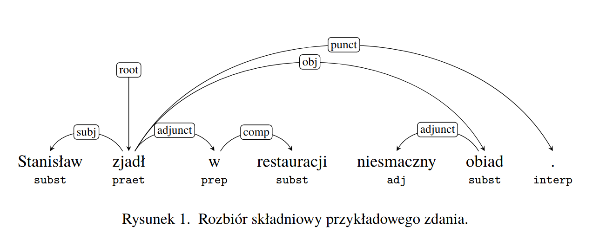

 .. role:: small-caps
    :class: small-caps

Tworzenie zapytań do korpusu
^^^^^^^^^^^^^^^^^^^^^^^^^^^^

Wprowadzenie
============

Niniejszy dokument powstał w oparciu o `Ściągawkę do Narodowego Korpusu
Języka Polskiego <http://nkjp.pl/poliqarp/help/pl.html>`__, której
autorem jest Adam Przepiórkowski i którą następnie poprawiali
i rozszerzali Jakub Wilk i Aleksander Buczyński. *Ściągawka* stanowi
instrukcję użytkowania wyszukiwarki Poliqarp z Narodowym Korpusem Języka
Polskiego. Jej pełna wersja znajduje się w `repozytorium wyszukiwarki
Poliqarp <https://sourceforge.net/projects/poliqarp/files/poliqarp/1.3.13/>`__.

Aktualna wersja tego dokumentu została przygotowana przez Witolda Kierasia i opisuje
sposób użytkowania wyszukiwarki MTAS, niepowiązanej z Poliqarpem, ale
wykorzystującej podobny język zapytań znany pod nazwą *Corpus Query
Language* (CQL). Modyfikacje wprowadzone do pierwotnej wersji instrukcji
uwzględniają różnice w języku zapytań oraz w tagsecie stosowanym
w Korpusomacie. Za zgodą wszystkich wyżej wymienionych autorów niniejsza
wersja dokumentu zostaje udostępniona na zasadach `licencji Creative
Commons
BY-SA <https://creativecommons.org/licenses/by-sa/4.0/legalcode.pl>`__.

Segmentacja
===========

Znaczniki morfosyntaktyczne, tzw. tagi, przypisane są segmentom
(tokenom, w przybliżeniu słowom). Segmenty nie są dłuższe niż słowa
ortograficzne (słowa ‘od spacji do spacji’ z oddzieleniem znaków interpunkcyjnych), ale w niektórych wypadkach
segmenty mogą być krótsze niż takie słowa. Szczegółowe zasady segmentacji dla poszczególnych języków mogą się różnić i zależą od decyzji podjętych przez twórców zasobów jezykowych dla danego języka (głównie twórców banków drzew zależnościowych) oraz przez twórców konkretnych narzędzi programistycznych. Przykładowo, w korpusach języka polskiego (w tym m.in. w Narodowym Korpusie Języka Polskiego) na etapie segmentacji zwykło się oddzielać od form przeszłych czasowników tzw. aglutynant (wykładnik osoby i liczby) a także partykułę *by* będącą wykładnikiem trybu warunkowego. W efekcie słowo jedno słowo tekstowe zostaje rozbite odpowiednio na dwa lub trzy segmenty i każdemu z nich jest przypisana osobna interpretacja fleksyjna: np. *[pisał][eś]*, *[jedli][by][śmy]*. Jednak w Korpusomacie ta decyzja jest dodatkowo zależna od wybranego potoku przetwarzania, bowiem twórcy tych potoków podjęli w tej sprawie różne decyzje: Stanza stosuje segmentację taką, jak w Narodowym Korpusie Języka Polskiego, czyli oddziela aglutynant i partykułę *by*, ale spaCy uznaje formy czasu przeszłego oraz trybu warunkowego za pojedyncze segmenty i nie rozbija ich. To jednak rzadkie i skrajne przypadki wynikające ze specyfiki wykorzystanych narzędzi — w większości wypadków teksty w poszczególnych językach powinny być segmentowane w obu potokach tak samo i zgodnie z typową dla danego języka segmentacją stosowaną w bankach drzew składniowych oraz korpusach narodowych danych języków.

Znaczniki morfosyntaktyczne
=====================================

Wszystkie korpusy w Korpusomacie zawierają warstwę informacji morfosyntaktycznej zgodną ze specyfikacją Universal Dependencies. Informacja ta jest rozdzielona na dwie składowe: oznaczenie części mowy (tzw. UPOS — *universal part of speech*) oraz cechy morfosyntaktyczne (tzw. UFEATS — *universal features*). Obie te składowe (nazwy części mowy, nazwy cech morfoskładniowych i listy ich możliwych wartości) są opisane w dokumentacji `na stronie projektu UD <https://universaldependencies.org/guidelines.html>`__. Ponieważ z zasady jest to opis uniwersalny, każdy z konkretnych języków korzysta tylko z podzbioru cech morfologicznych i ich wartości. 

Oprócz informacji morfosyntaktycznej zgodnej ze specyfikacją UD w większości korpusów dostępny jest również dodatkowy znacznik, tzn. XPOS, który przechowuje informację morfosyntaktyczną zgodną z tagsetem stosowanym w zasobach dla danego języka. Oba potoki przetwarzania dostarczają znakują teksty również znacznikami XPOS, ale ich konkretna postać zależy zarówno od twórców narzędzi, jak i twórców banku drzew UD. W szczególności od twórców banku drzew zależy, jaka postać znacznika znajdzie się w polu XPOS — zarówno pod względem szczegółowości opisu morfosyntaktycznego, jak i technicznego opisu samego tagsetu, dlatego nie mają one ustandaryzowanej wspólnej postaci. Najczęściej są to jednak systemy znaczników stosowane w narodowych korpusach tych języków. W wypadku gdy twórcy banku drzew UD nie umieścili w nim znaczników XPOS, Korpusomat również nie umożliwa korzystania z nich — tak jest wypadku języka rosyjskiego (w obu potokach przetwarzania). W niektórych wypadkach postać znacznika XPOS może się różnić w zależności od potoku przetwarzania, np. w wypadku języka polskiego Stanza zwraca pełne znaczniki morfosyntaktyczne (w tagsecie stosowanym w polskich korpusach), spaCy zaś ogranicza się tylko do pierwszej części takiego znacznika oznaczającej przynależność słowa do klasy gramatycznej.

Język zapytań
=============

Składnia zapytań w programie MTAS została oparta na języku zapytań
o nazwie Corpus Query Language (CQL), który jest powszechnie znany i stosowany w wyszukiwarkach korpusowych. 
Niniejszy rozdział omawia składnię CQL w wariancie zastowanych w Korpusomacie.

MTAS jest uniwersalną wyszukiwarką pozwalającą na przeszukiwanie
korpusów zawierających wiele warstw anotacyjnych. Niniejsza instrukcja dotyczy przeszukiwania korpusów 
postaci indeksowanej przez Korpusomat, który tworzy
aktualnie trzy warstwy znakowania: warstwę morfosyntaktyczną
i składniową oraz warstwę jednostek nazewniczych. Ogólna podstawowa dokumentacja 
wyszukiwarki MTAS znajduje się `na jej stronie internetowej <https://meertensinstituut.github.io/mtas/>`__.

Zapytania o segmenty
--------------------

Podstawową jednostką wyszukiwaną w korpusie jest segment. Segmenty
w zapytaniach są ograniczone nawiasami kwadratowymi, wewnątrz których
można określać konkretne cechy, które segment ma spełniać.
W najprostszym przypadku jest to kształt tekstowy (napis). Do zapytań
o tę postać ortograficzną segmentu służy atrybut ``orth``, można też
jednak ograniczyć się do wpisania w oknie wyszukiwarki poszukiwanego
słowa (lub słów). Zatem poniższe zapytanie o dwa sąsiadujące ze sobą
segmenty:

::

     [orth="komisja"][orth="szkolna"]

można zadać również w prostszy sposób:

::

     komisja szkolna

Domyślnie rozróżniana jest kasztowość (wielkość) liter, a zatem poniższe
dwa zapytania dadzą różne wyniki:

-  ``przyszedł``

-  ``Przyszedł``

Dostępny jest jednak dodatkowy atrybut pomocniczy ``orth_lc`` (``lc`` od
ang. *lower case*) przechowujący postać ortograficzną segmentu
z zamienionymi literami wielkimi na małe. Dzięki temu można wyszukiwać
słowa zapisane w różny sposób bez konieczności odwoływania się do
wyrażeń regularnych. Na przykład zapytanie ``[orth_lc="przyszedł"]``
zwróci wystąpienia słów postaci *przyszedł* i *Przyszedł*, jak również
*PRZYSZEDŁ* czy *PRzySZedŁ*.

W zapytaniach o segmenty mogą wystąpić standardowe wyrażenia regularne
wykorzystujące następujące znaki specjalne: ``?``, ``*``, ``+``, ``.``,
``,``, ``|``, ``,``, ``[``, ``]``, ``(,`` ``)`` oraz liczby naturalne
pisane cyframi arabskimi, np. ``0`` czy ``21``. Ponieważ formalny opis
wyrażeń regularnych wykracza poza ramy niniejszej instrukcji,
ograniczymy się tutaj do kilku przykładów, które powinny pozwolić
użytkownikowi na szybkie przyswojenie składni i znaczenia takich
wyrażeń.

#. ::

      [orth="(Ala|Ela)"]

   znak ``|`` oznacza alternatywę dwóch wyrażeń (całość należy dodatkowo
   ująć w nawiasy okrągłe), a zatem zapytanie to może zostać użyte do
   znalezienia wszystkich wystąpień segmentów *Ala* lub *Ela*,

#. ::

      [orth="[AE]la"]

   nawiasy kwadratowe oznaczają alternatywę znaków, a zatem zapytanie to
   może zostać użyte do znalezienia tych segmentów, których pierwszy
   znak to *A* lub *E*, po którym następuje ciąg znaków postaci *la*,
   tj. zapytanie to jest równoważne poprzedniemu,

#. ::

      [orth="beza?"]

   znak zapytania oznacza opcjonalność znaku (tutaj ostatniego *a*) lub
   ujętego w nawiasy okrągłe wyrażenia bezpośrednio poprzedzającego znak
   ``?``, a zatem w wyniku zadania tego zapytania znalezione zostaną
   segmenty *bez* i *beza*,

#. ::

      [orth="bez."]

   kropka oznacza dowolny znak, a zatem wynikiem tego zapytania będą
   segmenty *beza*, *bezy*, *bezą* itp., ale nie *bez* czy *bezami*,

#. ::

      [orth="bez.?"]

   *bez*, *beza*, *bezy*, *bezą* itp., ale nie *bezami*,

#. ::

      [orth=".z.z."]

   segmenty pięcioznakowe, w których 2. i 4. znak to *z* (np. *czczą*
   i *rzezi*),

#. ::

      [orth=".z.z..?"]

   segmenty składające się z pięciu lub sześciu znaków, w których 2.
   i 4. znak to *z*, np. *czczą*, *rzezi* i *szczyt*,

#. ::

      [orth="a*by"]

   gwiazdka oznacza dowolną liczbę wystąpień znaku lub wyrażenia
   bezpośrednio przed nią, a zatem zapytanie to może posłużyć do
   znalezienia segmentów składających się z dowolnej liczby liter *a*,
   po których następuje ciąg *by*, np. *by* (zero wystąpień *a*), *aby*,
   *aaaaby* itp.,

#. ::

      [orth="Ala.*"]

   segmenty zaczynające się na *Ala*, np. *Ala* i *Alabama*,

#. ::

      [orth=".*al+"]

   plus ma działanie podobne do gwiazdki i oznacza dowolną większą od
   zera liczbę wystąpień znaku lub wyrażenia bezpośrednio przed nim,
   a zatem wynikiem tego zapytania będzie znalezienie segmentów
   kończących się na *al*, *all*, *alll* itd., ale nie na *a*, np.
   *dal*, *robal* i *Gall*,

#. ::

      [orth="a{1,3}b.*"]

   konstrukcja typu ``n,m`` oznacza od ``n`` do ``m`` wystąpień znaku
   lub wyrażenia bezpośrednio przed nią, a zatem zapytanie to pomoże
   znaleźć segmenty zaczynające się od ciągu od 1 do 3 liter a, po
   którym następuje litera b, a następnie dowolny ciąg znaków (por.
   ``.*``), np. *aby*, *aaaby*, *absolutnie*,

#. ::

      [orth=".*(la){3,}.*"]

   konstrukcja typu ``n,`` oznacza co najmniej ``n`` wystąpień znaku lub
   ujętego w nawiasy okrągłe wyrażenia bezpośrednio przed nią, a zatem
   zapytanie to może posłużyć do znalezienia segmentów, w których ciąg
   *la* występuje przynajmniej 3 razy z rzędu, np. *tralalala*,
   *sialalala*, [lala]

#. ::

      [orth="[bcćdfghjklłmnńprsśtwzźż]{4,}[aąeęioóuy]"]

   segmenty składające się z co najmniej 4 liter spółgłoskowych
   i dokładnie jednej litery samogłoskowej, np. *źdźbła*, *drzwi*
   i *czczą*; wyrażenie ``[bcćdfghjklłmnńprsśtwzźż]{4,}`` oznacza co
   najmniej czterokrotne powtórzenie znaku pasującego do
   ``[bcćdfghjklłmnńprsśtwzźż]``, tj. co najmniej cztery wystąpienia
   litery spółgłoskowej (niekoniecznie tej samej),

#. ::

      [orth="([bcćdfghjklłmnńprsśtwzźż]{3}[aąeęioóuy]){2,}"]

   segmenty składające się z co najmniej dwukrotnego powtórzenia wzorca
   CCCV, gdzie C to litera spółgłoskowa, a V to litera samogłoskowa, np.
   *wszystko*, *przykrzejszy* i *szlachta*; konstrukcja typu ``n``
   oznacza dokładnie ``n`` wystąpień znaku lub ujętego w nawiasy okrągłe
   wyrażenia bezpośrednio przed nią,

#. ::

      [orth="(pod|na|za)jecha.*"]

   segmenty zaczynające się od *podjecha*, *najecha* i *zajecha*, np.
   *podjechał*, *zajechawszy*.

Specyfikacje segmentów podane powyżej muszą pasować do całych segmentów
stąd konieczność umieszczenia po obu stronach ciągu ``(la){3,}`` w
zapytaniu ``[orth=".*(la){3,}.*"]``
wyrażenia ``.*``, pasującego do dowolnego ciągu znaków.

Zapytania z innymi atrybutami
-----------------------------

Aby znaleźć wszystkie formy leksemu *korpus*, można użyć następującego
zapytania:

::

   [lemma="korpus"]

Atrybut ``lemma`` jest jednym z wielu możliwych atrybutów, jakie mogą
pojawić się w zapytaniu. Wartością tego atrybutu powinna być
forma podstawowa (hasłowa), a zatem zapytanie
``[lemma="pisać"]`` może być użyte do znalezienia form typu *pisać*,
*piszę*, *pisała*, *piszcie*, *pisanie*, *pisano*, *pisane* itp.

Podobnie jak w wypadku atrybutu ``orth`` wartościami atrybutu ``lemma``
mogą być wyrażenia regularne, np:

::

   [lemma="komit[ae]t"]

znalezione zostaną wszystkie segmenty, których forma hasłowa ma postać
komitet lub komitat.

Zapytania o różne atrybuty segmentów można łączyć. Na przykład, aby
znaleźć wszystkie wystąpienia segmentu *minę* rozumianego jako forma
leksemu mina (a nie na przykład leksemu minąć), można zadać następujące
zapytanie:

::

   [orth="minę" & lemma="mina"] 

Podobne znaczenie ma następujące zapytanie o te wystąpienia segmentu
*minę*, które nie są interpretowane jako formy leksemu minąć.

::

   [orth="minę" & !lemma="minąć"]

W powyższych zapytaniach operator ``&`` spełnia rolę logicznej
koniunkcji. Operatorem do niego dualnym jest operator ``|``, spełniający
rolę logicznej alternatywy. Oto kilka przykładów użycia tego operatora:

-  ::

      [lemma="on" | lemma="ja"]

   wszystkie formy zaimków *on* i *ja*, równoważne zapytaniu
   ``[lemma="on|ja"]``,

-  ::

      [lemma="on" | orth="mnie" | orth="ciebie"]

   wszystkie formy zaimka *on*, a także segmenty *mnie* i *ciebie*,

-  ::

      [orth="pora" & !(lemma="por" | lemma="pora")]

   segment *pora* niebędący ani formą leksemu *por*, ani formą leksemu
   *pora*.

Aby lepiej zrozumieć różnicę pomiędzy operatorami ``&`` i ``|``,
porównajmy następujące dwa zapytania:

::

   [orth="minę" & lemma="mina"]
   [orth="minę" | lemma="mina"]

W wyniku zadania pierwszego zapytania znalezione zostaną te segmenty,
które są jednocześnie (koniunkcja) segmentem *minę* i formą leksemu
mina, a więc wyłącznie te wystąpienia segmentu *minę*, które są
interpretowane jako formy leksemu mina. W wyniku zadania drugiego
zapytania znalezione natomiast zostaną te segmenty, które są albo
dowolnie interpretowanym segmentem *minę*, albo formą leksemu mina
(alternatywa), czyli wszystkie wystąpienia zarówno segmentu minę, jak
i segmentów mina, miny, minami itp. interpretowanych jako formy leksemu
mina.

Specyfikacje pozycji w korpusie, ujęte w nawiasy kwadratowe, mogą
zawierać dowolną liczbę warunków typu ``atrybut="wartość"`` (na przykład
``orth="nie"``) połączonych operatorami ``!``, ``&`` i ``|``, tak jak
pokazują to powyższe przykłady. Możliwe jest także całkowite pominięcie
jakichkolwiek warunków. Poniższe zapytanie mogłoby posłużyć do
znalezienia wszystkich segmentów w korpusie.

::

   []

Taka „pusta” specyfikacja pozycji w korpusie, pasująca do dowolnego
segmentu, może posłużyć na przykład do znalezienia dwóch form
oddzielonych od siebie dowolnymi dwoma segmentami, np.:

::

   [orth="się"][][][lemma="bać"]

W wyniku tego zapytania zostaną znalezione ciągi takie jak *się mnie też
bać* czy *się nie chcę bać*.

Dla wielu zastosowań ciekawsza byłaby możliwość zapytania na przykład
o formy oddalone od siebie o najwyżej pięć pozycji. MTAS umożliwia
zadawanie takich pytań, gdyż pozwala na formułowanie wyrażeń regularnych
także na poziomie pozycji korpusu. Na przykład zapytanie o formę leksemu
*bać* występującą dwie, trzy lub cztery pozycje dalej niż forma *się* może
wyglądać następująco:

::

   [orth="się"][]{2,4}[lemma="bać"]

W wyniku tego zapytania zostaną znalezione ciągi uzyskane w wyniku
poprzedniego zapytania, a także na przykład ciąg *się pani niczego nie
boi*.

Zapewne nieco bardziej precyzyjnym zapytaniem o różne wystąpienia form
tzw. czasownika zwrotnego *bać się* byłoby zapytanie o *się* w pewnej
odległości przed formą leksemu bać, ale bez znaku interpunkcyjnego
pomiędzy tymi formami, lub bezpośrednio za taką formą, ewentualnie
oddzielone od formy bać zaimkiem osobowym:

::

   [orth="się"][!orth="[.!?,:]"]{0,5}[lemma="bać"]
   | [lemma="bać"][lemma="on|ja|ty|my|wy"]?[orth="się"]

Zapytania o znaczniki morfosyntaktyczne
---------------------------------------

Powyższe zapytanie można uprościć poprzez zastąpienie warunku
``orth!="[.!?,:]"`` bezpośrednim odwołaniem do „klasy gramatycznej”
``interp``:

::

   [orth="się"][!upos="PUNCT"]{0,5}[lemma="bać"]
   | [lemma="bać"][lemma="on|ja|ty|my|wy"]?[orth="się"]

Ogólniej, wartościami atrybutu ``upos`` (*universal part of speech*) są skróty nazw klas gramatycznych 
`omówionych w dokumentacji Universal Dependencies <https://universaldependencies.org/u/pos/index.html>`__. Na przykład
zapytanie o sekwencję dwóch form rzeczownikowych rozpoczynających się na
*a* może być sformułowane w sposób następujący:

::

   [upos="NOUN" & orth="a.*"]{2}

Podobnie jak to miało miejsce w wypadku specyfikacji form obu warstw
tekstowych i form hasłowych, także specyfikacje klas gramatycznych mogą
zawierać wyrażenia regularne.

Dodatkowo za pomocą atrybutu ``xpos`` można odwołać się w zapytaniu do znacznika specyficznego dla języka. Specyfikacja tego atrybutu również może zawierać wyrażenia regularne. Na przykład w korpusie stworzony w języku czeskim następujące zapytanie:

::

   [xpos="NNNS1.*"]
 
wyszuka wszystkie rzeczowniki w rodzaju nijakim w mianowniku liczby pojedynczej. Rzeczowniki o tych samych cechach w polskim korpusie znajdzie zapytanie:

::

   [xpos="subst:sg:nom:n.*"]

W obu wypadkach wartość atrybutu ``xpos`` jest zakończona wyrażeniem ``.*``, ponieważ po wartościach 
części mowy, liczby, rodzaju i przypadka mogą pojawić się jeszcze wartości innych kategorii uwzględnionych 
w obu tagsetach. 

W zapytaniach można określić nie tylko postać ortograficzną segmentu (za
pomocą atrybutu ``orth``), formę hasłową (za pomocą ``lemma``) i klasę
gramatyczną (za pomocą ``upos`` lub ewentualnie ``xpos``), ale także wartości poszczególnych
kategorii gramatycznych, np. przypadka czy rodzaju — o ile te kategorie występują w danym języku. W korpusach 
danego języka można używać atrybutów o nazwie kategorii obecnych w banku drzew zależnościowych w warstwie 
cech morfosyntaktycznych (UFEATS) dla tego języka. Listę wszystkich kategorii można znaleźć `na stronie Universal Dependencies <https://universaldependencies.org/u/feat/all.html>`__. 
 

A zatem w korpusach dla języków posiadających liczbę gramatyczną możliwe jest zadanie na przykład następujących zapytań:

#. ::

      [number="sing"]

   znalezione zostaną wszystkie formy w liczbie pojedynczej,

#. ::

      [upos="NOUN" & number="sing"]

   znalezione zostaną formy rzeczowników pospolitych w liczbie pojedynczej,

#. ::

      [upos="NOUN" & !gender="fem"]

   formy rzeczowników pospolitych w rodzaju innym niż żeński (czyli np. dla polskiego, czeskiego czy ukraińskiego: w rodzaju męskim lub nijakim),

#. ::

      [number="sing" & case="(nom|acc)" & gender="masc"]

   pojedyncze mianownikowe lub biernikowe formy męskie (jeśli w języku są kategorie liczby, przypadka i rodzaju).

..
 Ponieważ nazwy wartości poszczególnych kategorii są rozłączne, można
 również stosować zbiorczą kategorię ``feat`` (ang. *feature* ‘cecha’)
 w zastępstwie każdej innej. Ujednoznacznienie dokona się przez
 odpowiednią wartość. Dlatego następujące dwa zapytania zwrócą te same
 wyniki:
..
 -  ``[pos="subst" & case="acc" & number="pl" & gender="f"]``

 -  ``[pos="subst" & feat="acc" & feat="pl" & feat="f"]``

..
 Interpretacje spoza słownika
 ----------------------------

 Interpretacje fleksyjne w znakowaniu morfosyntaktycznym Korpusomatu
 pochodzą z analizatora Morfeusz 2 i tagera Concraft 2 — analizator
 zwraca wszystkie możliwe interpretacje dla danego słowa, a tager wybiera
 najbardziej prawdopodobną ze względu na swój model statystyczny.
 Interpretacje Morfeusza pochodzą ze `Słownika gramatycznego języka
 polskiego <http://www.sgjp.pl/>`__ (SGJP). Jeśli danego słowa nie da się
 w żaden sposób zinterpretować jako formy wyrazowej leksemu zanotowanego
 w SGJP, to Morfeusz nie zwraca żadnej interpretacji. Wówczas tager
 „zgaduje” znacznik morfosyntaktyczny, czyli wybiera taki, który zgodnie
 z jego modelem jest najbardziej prawdopodobny. Skuteczność zgadywania
 jest w oczywisty sposób dużo niższa niż skuteczność wybierania spośród
 gotowych interpretacji z Morfeusza, dlatego użytkownik może uznać za
 przydatną możliwość sterowania tym parametrem w swoich wyszukaniach, np.
 w wypadku słownictwa najnowszego, nienotowanego w słownikach. Segmenty,
 którym Morfeusz nie przypisał żadnej interpretacji, mają dodatkowy
 parametr postaci ``[ign="true"]``. Poniższe przykładowe zapytanie
 odnajdzie w korpusie wszystkie słowa, które zaczynają się od „tofu”
 i nie są znane Morfeuszowi:

 ::

    [orth="tofu.*" & ign="true"]

 Analogicznie można usunąć z wyszukiwania interpretacje zgadywane, np.:

 ::

    [pos="subst" & !ign="true"]

Graficzny konstruktor zapytań
-----------------------------

Do tworzenia podstawowych zapytań o sekwencje segmentów można użyć
prostego graficznego konstruktora. W oknie konstruktora można definiować
warunki określające cechy kolejnych segmentów zapytania, np. część mowy,
postać segmentu w obu warstwach tekstowych, formę hasłową, a także
wartości wszystkich kategorii gramatycznych opisanych w tabeli
`1 <#tab:kategorie>`__. Poszczególne warunki w obrębie segmentu mogą być
łączone operatorami *oraz* (koniunkcja) i *lub* (alternatywa). Po
zdefiniowaniu wszystkich segmentów zapytania należy wcisnąć przycisk
*Zapisz*, następnie określić dodatkowe parametry wyszukania, np.
ograniczenia za pomocą metadanych, i rozpocząć wyszukiwanie. Zbudowane
za pomocą konstruktora zapytania pojawi się w pasku wyszukiwania, dzięki
czemu można dodatkowo zweryfikować jego poprawność.

Ograniczenie zapytania do zdania lub akapitu
--------------------------------------------

Jednostkami organizacji tekstu w korpusach indeksowanych przez
Korpusomat są zdania i akapity. Podział ten można wykorzystać w
zapytaniach, na przykład ograniczając dopasowanie do jednego zdania.

Aby ograniczyć zasięg zapytania, należy dopisać do zapytania słowo
kluczowe ``within``, a po nim ``<s/>`` lub ``
``, w zależności od
tego, czy zasięg ma być ograniczony do zdania (ang. *sentence*) czy do
akapitu (ang. *paragraph*). Ilustruje to następujący przykład zapytania
o zdania, w których forma *się* występuje za formą leksemu być,
w odległości co najmniej jednego i nie więcej niż dziesięciu segmentów:

::

   [lemma="bać"][!orth="się"]{1,10}[orth="się"] within <s/>

Dodatkowo można również na elementy ``<s/>`` i ``
`` nałożyć pewne
warunki dotyczące tego, czy zawierają segmenty innego typu. Przykładowo,
za pomocą następującego zapytania można znaleźć wszystkie wystąpienia
czasownika być w  czasie przyszłym złożonym ograniczone do zdań
zawierających formę bezokolicznika:

::

   [pos="bedzie"] within (<s/> containing [pos="inf"])

Intencją takiego zapytania jest odnalezienie (w przybliżeniu) wszystkich
wystąpień konstrukcji czasu przyszłego złożonego, w których pojawia się
bezokolicznik. Wśród wyników będą oczywiście również takie zdania,
w których czas przyszły został utworzony z formy pseudoimiesłowu,
a bezokolicznik pełni w zdaniu inną funkcję gramatyczną. Można też
sformułować zapytanie odwrotnie i zapytać o zdania, w których forma
pseudoimiesłowu w ogóle nie występuje:

::

   [pos="bedzie"] within (<s/> !containing [pos="praet"])

Pełną listę słów kluczowych, które mogą się pojawić w zapytaniach
wyszukiwarki MTAS, można znaleźć w jej
`dokumentacji <https://meertensinstituut.github.io/mtas/search_cql.html>`__,
nie wszystkie jednak będą miały sensowne zastosowanie w Korpusomacie.

Oprócz znaczników odnoszących się do elementów struktury tekstu (np.
``<s/>``) istnieją również znaczniki odnoszące się do ich początku
i końca. W wypadku ``<s/>`` będą to odpowiednio: ``<s>`` i ``</s>``. Ich
dopasowaniem nie jest żaden segment, ale mogą być użyte w połączeniu
z warunkami definiującymi inne segmenty, np. zapytanie:

::

   <s> [pos="num"]

odnajdzie wszystkie wystąpienia liczebnika stojącego na początku zdania.
Analogicznie zapytanie:

::

   [pos="num"][pos="interp"]</s>

odnajdzie wszystkie wystąpienia ciągu składającego się z liczebnika
i znaku interpunkcyjnego stojących na końcu zdania.

Warstwa składniowa
------------------

W Korpusomacie jest również wbudowany parser zależnościowy Combo.
Wprowadzony przez użytkownika tekst jest automatycznie dzielony na
wypowiedzenia, które z kolei są poddawane pełnej analizie składniowej
w aparacie zależnościowym według zasad przyjętych w `Polskim Banku Drzew
Zależnościowych <http://zil.ipipan.waw.pl/PDB>`__. Przykład takiej
analizy znajduje się na poniższym rysunku.

MTAS nie jest wyszukiwarką struktur składniowych, nie pozwala zatem na
indeksowanie i przeszukiwanie pełnych rozbiorów zdań. Jednak na poziomie
każdego segmentu w tekście Korpusomat indeksuje informację o jego
bezpośrednim nadrzędniku składniowym (tzn. jego formie hasłowej i klasie
fleksyjnej) oraz o typie relacji zależności łączącej oba te elementy
w wypowiedzeniu. Ponadto indeksuje również ich położenie względem siebie
w wypowiedzeniu: kolejność w porządku linearnym oraz odległość (liczoną
w segmentach). Pozwala to na łatwe wyszukanie w korpusie prostszych
konstrukcji składniowych oraz analitycznych nieciągłych form
fleksyjnych.

W warstwie znakowania składniowego dostępne są następujące atrybuty:

-  ``deprel`` — typ zależności, jaką dany segment jest związany ze swoim
   bezpośrednim nadrzędnikiem składniowym; wartością tego atrybutu może
   być jeden z 28 typów zależności przewidzianych w `Polskim Banku Drzew
   Zależnościowych <http://zil.ipipan.waw.pl/PDB/DepRelTypes>`__,

-  ``head.pos`` — klasa fleksyjna bezpośredniego nadrzędnika segmentu
   (tabela `2 <#tab:klasy>`__),

-  ``head.base`` — forma hasłowa bezpośredniego nadrzędnika segmentu,

-  ``head.distance`` — odległość bezpośredniego nadrzędnika segmentu,

-  ``head.position`` — położenie (lewo- lub prawostronne) bezpośredniego
   nadrzędnika względem segmentu w porządku linearnym wypowiedzenia.

Dzięki rozszerzeniu języka zapytań o powyższe atrybuty można np. łatwo
znaleźć wszystkie rzeczowniki użyte w funkcji dopełnienia bliższego
konkretnego czasownika:

::

   [pos="subst" & deprel="obj" & head.base="kupić"]

Możliwe jest również odwrotne wyszukanie odpowiadające na pytanie, przy
jakich czasownikach w roli dopełnienia występuje w korpusie konkretny
rzeczownik:

::

   [deprel="obj.*" & head.pos="(fin|praet|ppas|pact|ger|impt|imps)" & base="betel"]

Należy jednak zwrócić uwagę, że w powyższym przykładzie wynikiem
zapytania będą wystąpienia rzeczownika betel, nadrzędne względem nich
formy czasownikowe (finitywne i niefinitywne) będą się zaś znajdowały
w lewym lub prawym kontekście wyników wyróżnione pismem pogrubionym.
Można je jednak zgrupować i posortować względem ich częstości dzięki
opcjom Statystyk. Wartością atrybutu ``deprel`` jest wyrażenie
regularne, do którego dopasowują się dwa możliwe typy relacji
zależności: *obj* i *obj_th* opisane w dokumentacji Polskiego Banku
Drzew Zależnościowych.

Podobne wyszukanie możliwe jest również w wypadku wymagań czasownika
innych niż nominalne. Na przykład za pomocą zapytania:

::

   [deprel="comp" & head.pos="(fin|praet|imps|impt|ppas|pact)" & base="o" & case="loc"]

można znaleźć czasowniki wymagające frazy przyimkowej miejscownikowej
z przyimkiem o.

Dzięki atrybutowi kodującemu lewo- i prawostronną pozycję nadrzędnika
względem segmentu można znaleźć przykłady niekanonicznego szyku zdania,
np. podmiotu po orzeczeniu:

::

   [deprel="subj" & head.position="left"]

lub dopełnienia bliższego przed orzeczeniem:

::

   [deprel="obj" & head.position="right"]

Podobnie w wypadku innych konstrukcji — brak określenia pozycji
nadrzędnika w zapytaniu:

::

   [upos="ADJ" & deprel="amod" & head.lemma="zupa"]

zwróci wszystkie przymiotnikowe określenia rzeczownika ZUPA. Dodanie
parametru pozycji pozwoli ograniczyć wyszukanie do określeń
lewostronnych (np. *gorąca zupa*) lub prawostronnych (np. *zupa
pomidorowa*).

Częściowa anotacja składniowa pozwala na odnalezienie elementów
wypowiedzenia połączonych ze sobą bezpośrednią relacją zależności bez
względu na to, czy sąsiadują one ze sobą w porządku linearnym, czy też
są przedzielone innymi elementami wypowiedzenia. Atrybut odległości
pozwala np. na ograniczenie wyników tylko do takich przypadków,
w których elementy nie sąsiadują ze sobą:

::

   [deprel="obj" & head.pos="praet" & !head.distance="1"]

Powyższe przykładowe zapytanie wyszuka dopełnienia bliższe orzeczenia
w czasie przeszłym, które są oddzielone od tego orzeczenia co najmniej
jednym elementem.

Jeszcze jednym praktycznym przykładem wykorzystania anotacji składniowej
jest możliwość wyszukania analitycznych form fleksyjnych, których
poszczególne fleksemy nie są oznaczane w warstwie morfosyntaktycznej
jako elementy takiej formy. Dotyczy to np. form czasu przyszłego
niedokonanego (utworzonych z formami bezokolicznika lub pseudoimiesłowu
lub w obu wariantach):

::

   [pos="bedzie" & deprel="aux" & head.pos="(inf|praet)"]

czy analitycznych form stopnia wyższego i najwyższego przymiotników:

::

   [deprel="adjunct" & base="bardzo" & degree="(com|sup)" & head.pos="adj"]

Podobnie w wypadku konstrukcji biernej:

::

   [base="(być|zostać)" & deprel="aux" & head.pos="ppas"]

Warstwa jednostek nazewniczych
------------------------------

Korpusy indeksowane przez Korpusomat zawierają również warstwę
znakowania jednostek nazewniczych (ang. *named entities*). Są to
jednostki tekstowe jedno- lub wielowyrazowe nazywające osoby, miejsca,
instytucje czy momenty czasowe. Automatycznym klasyfikowaniem takich
jednostek tekstowych zajmuje się wbudowany w Korpusomat program
`Liner2 <https://github.com/CLARIN-PL/Liner2>`__, który określa początek
i koniec danej jednostki nazewniczej oraz przydziela jej odpowiednią
etykietę. Liner2 opiera się na wzorcowej anotacji jednostek nazewniczych
przygotowanej w ramach projektu NKJP, której szczegóły zostały opisane
w rozdziale *Anotacja jednostek nazewniczych* (str. 129-167) książki
`Narodowy Korpus Języka
Polskiego <http://nkjp.pl/settings/papers/NKJP_ksiazka.pdf>`__.
Niniejsza instrukcja ogranicza się jedynie do opisania sposobu
korzystania z tej klasyfikacji w wyszukiwarce Korpusomatu.

Jednostki nazewnicze, podobnie jak opisane wyżej zdania i akapity,
przekraczają granicę segmentu, więc można się do nich odnosić
w zapytaniach korpusowych tak samo jak do zdań, za pomocą znacznika
``<ne />``. Obowiązują również te same zasady dotyczące znaku ukośnika
wewnątrz znacznika:

-  ``<ne>`` oznacza początek ciągu opisanego jako jednostka nazewnicza,

-  ``</ne>`` oznacza koniec ciągu opisanego jako jednostka nazewnicza.

Najprostsze możliwe zapytanie tego typu ma postać:

::

   <ne />

i zwróci wszystkie jednostki nazewnicze wszystkich typów odnalezione
w korpusie. Wyszukanie można ograniczyć do konkretnego typu nazw np.
nazw miejsc:

::

   <ne="placeName" />

Ta kategoria jednostek ma swoją dodatkową podkategorię klasyfikującą
rodzaje miejsc: regiony, kraje, miejscowości itp. Następujące zapytanie
ograniczy wyniki jedynie do nazw krajów:

::

   <ne="placeName.country" />

Pełny repertuar wartości klasyfikacji jednostek nazewniczych to:

-  ``persName`` (nazwy osób) z podtypami: ``forename`` (imiona),
   ``surname`` (nazwiska) i ``addName`` (pseudonimy, przydomki itp.),

-  ``orgName`` (nazwy organizacji),

-  ``geogName`` (nazwy geograficzne),

-  ``placeName`` (nazwy miejsc czy też tzw. nazwy geopolityczne)
   z podtypami: ``district`` (jednostki administracyjne miast, np.
   *Mokotów*), ``settlement`` (miasta, wioski, osady, np. *Warszawa*),
   ``region`` (jednostki administracyjne większe niż miasto, np.
   *województwo mazowieckie*), ``country`` (państwa, kraje, wspólnoty,
   kolonie, np. *Polska*, *Gujana Francuska*), ``bloc`` (organizacje
   polityczne obejmujące co najmniej dwa państwa, np. *Unia Europejska*,
   *Grupa Wyszehradzka*),

-  wyrażenia czasowe: ``date`` (daty kalendarzowe, np. 13 sierpnia 2018
   r.) oraz ``time`` (określenia czasu w postaci godzin, minut i sekund,
   np. *ósma wieczorem*).

Podobnie jak w wypadku zdań i akapitów, zapytania o jednostki nazewnicze
można łączyć z cechami ortograficznymi i morfosyntaktycznymi segmentów,
z których są one zbudowane lub klasyfikacją nazewniczą ich elementów
składowych. Oto kilka przykładów takich zapytań:

::

   [pos="conj" & base="i"] within <ne="orgName" />
   
— wszystkie nazwy organizacji zawierające spójnik i, np. *Krajowa Rada Radiofonii i Telewizji* czy *Instytut Meteorologii i Gospodarki Wodnej*,

::

   <ne="persName" /> !containing <ne="persName.forename" />
   
— wszystkie jednostki nazywające osoby, których składową nie jest imię,

::

   <ne="geogName" /> [pos="conj"] <ne="geogName" />
   
— wystąpienia dwóch nazw geograficznych połączonych spójnikiem współrzędnym, np. *Europa Zachodnia lub Skandynawia*.

::

   [orth="A.*"][orth="M.*"] fullyalignedwith <ne="persName" />
   
— dwa kolejne segmenty, z których pierwszy zaczyna się od *A*, drugi zaś od *M* i które w całości w tekście występują jako nazwa osoby, np. *Adam Michnik*, *Antoni Macierewicz*.

.. image:: img/instrukcja/displacy-ud-tree.png
  :width: 1300
  :alt: Hierarchia typów jednostek nazewniczych w NKJP

..
 Warstwa znakowania wydźwięku emocjonalnego
 ------------------------------------------

 Znakowanie tekstów w Korpusomacie można również wzbogacić o oznaczenie
 wydźwięku emocjonalnego słów. Jest to znakowanie wyłącznie słownikowe,
 opierające się na zbiorze 2902 polskich rzeczowników, przymiotników
 i czasowników zebranych w bazie NAWL (*Nencki Affective Word List*)
 stworzonej w ramach `projektu prowadzonego w Instytucie Biologii
 Doświadczalnej im. M. Nenckiego
 PAN <https://exp.lobi.nencki.gov.pl/nawl-analysis>`__. W oparciu
 o badania ankietowe w słowniku sklasyfikowano słowa ze względu na
 kojarzące się z nimi podstawowe emocje: szczęście (*happiness*), złość
 (*anger*), smutek (*sadness*), strach (*fear*), wstręt (*disgust*) oraz
 słowa neutralne emocjonalnie (*neutral*) oraz takie, dla których
 wskazania były niejednoznaczne i nie umożliwiały zaklasyfikowania
 (*unclassified*). Poszczególnym klasom odpowiadają etykiety będące
 pierwszymi literami ich angielskich odpowiedników, czyli H, A, S, F, D,
 N, U. Etykiety są wartościami atrybutu ``sentiment.nawl``, którego można
 użyć w zapytaniach korpusowych. Przykładowo, zapytanie postaci:

 ::

    [sentiment.nawl="A"]

 odnajdzie wszystkie wystąpienia słów oznaczonych w słowniku NAWL jako
 kojarzące się ze złością. Tego typu zapytania można łączyć z warunkami
 dotyczącymi innych warstw znakowania (o ile zostały one wybrane przez
 użytkownika w trakcie tworzenia korpusu), na przykład można ograniczyć
 wyniki do określonych części mowy:

 ::

    [sentiment.nawl="A" & pos="adj"]

 czy do postaci hasłowej składniowego nadrzędnika w strukturze
 zależnościowej wypowiedzenia:

 ::

    [sentiment.nawl="H" & head.base="Polak"]

 Oczywiście należy pamiętać, że słownik NAWL jest stosunkowo niewielki,
 zatem zdecydowana większość słów w korpusie nie będzie miała
 przypisanych żadnych wartości wydźwięku emocjonalnego.

 W oryginalnej bazie danych słownika NAWL każde słowo zostało przypisane
 tylko do jednej kategorii. W zaimplementowanej w Korpusomacie wersji
 rozszerzonej tego słownika słowo może mieć przypisaną więcej niż jedną
 etykietę kategorii emocji, jeśli te emocje uzyskały w bazie odpowiednio
 wysoki wskaźnik. Na przykład rzeczownik wojna w słowniku rozszerzonym ma
 przypisane dwie etykiety: strach (F) i smutek (S). Zapytanie o każdą
 z tych emocji zwróci wystąpienia rzeczownika wojna w korpusie (o ile
 oczywiście to słowo się w nim znajduje). Jednak w oryginalnym słowniku
 ten sam rzeczownik jest przypisany do kategorii U, czyli słów
 niesklasyfikowanych ze względu na niejednoznaczne wskazania ankietowe.
 Obie wersje tego słownika są dostępne w Korpusomacie. Wyniki dla wersji
 rozszerzonej dostępne są pod atrybutem ``sentiment.nawl``, dla
 oryginalnej wersji zaś — pod atrybutem ``sentiment.nawl_org``. W wypadku
 korzystania wersji oryginalnej należy pamiętać, że w wynikach znacznie
 więcej słów będzie przypisanych do kategorii U.

 Ograniczenie zapytania za pomocą metadanych
 -------------------------------------------

 Teksty wprowadzane przez użytkownika do Korpusomatu są domyślnie
 opatrywane czterema polami metadanych o etykietach: autor, tytuł, rok
 wydania, gatunek. Od użytkownika zależy to, w jaki sposób zostaną one
 wypełnione, w szczególności mogą pozostać puste. Użytkownik może też
 zdefiniować własne pola o dowolnych etykietach.

 Pól metadanych można użyć następnie do ograniczenia zasięgu zapytań
 w wyszukaniach korpusowych. Służy do tego przycisk metadane, pod którym
 można zdefiniować takie ograniczenia. Można nałożyć wiele ograniczeń
 jednocześnie, dodając je za pomocą przycisku dodaj ograniczenie.

..
 Tabele
 ======

 Kategorie gramatyczne
 ---------------------
 .. container::
    :name: tab:kategorie

    .. csv-table:: Kategorie gramatyczne
       :file: kategorie-gramatyczne.csv
       :header-rows: 1

 Klasy gramatyczne
 -----------------
 .. container:: landscape

    .. container::
       :name: tab:klasy

       .. csv-table:: Klasy gramatyczne
          :file: klasy-gramatyczne.csv
          :header-rows: 1

 Skróty nazw klas gramatycznych oraz ich formy hasłowe
 -----------------------------------------------------
 .. container:: landscape

    .. container::
       :name: tab:haslowe

       .. csv-table:: Skróty nazw klas gramatycznych oraz ich formy hasłowe.
          :file: skroty.csv
          :header-rows: 1
