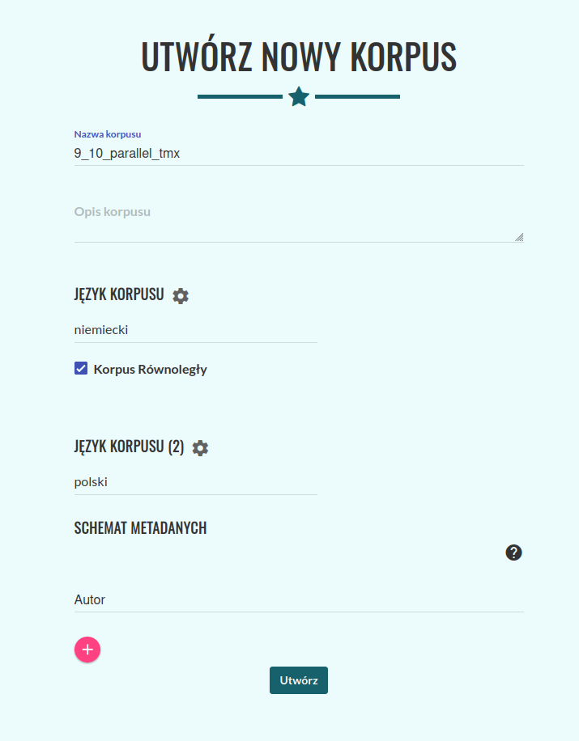
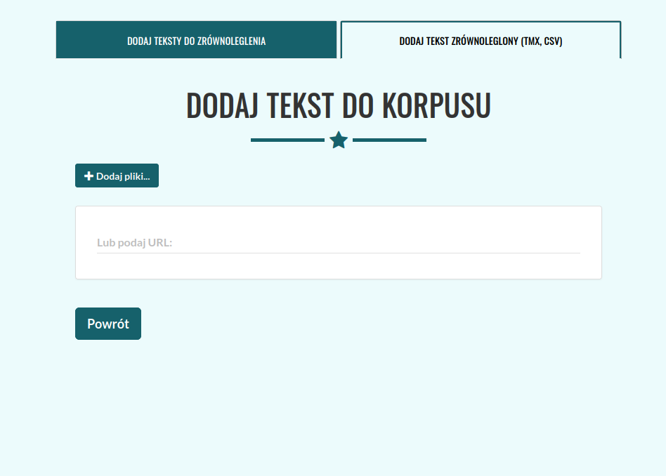
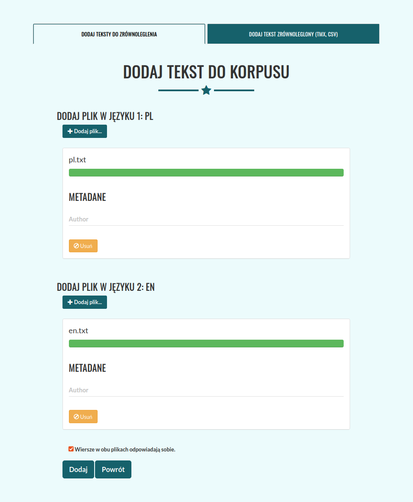
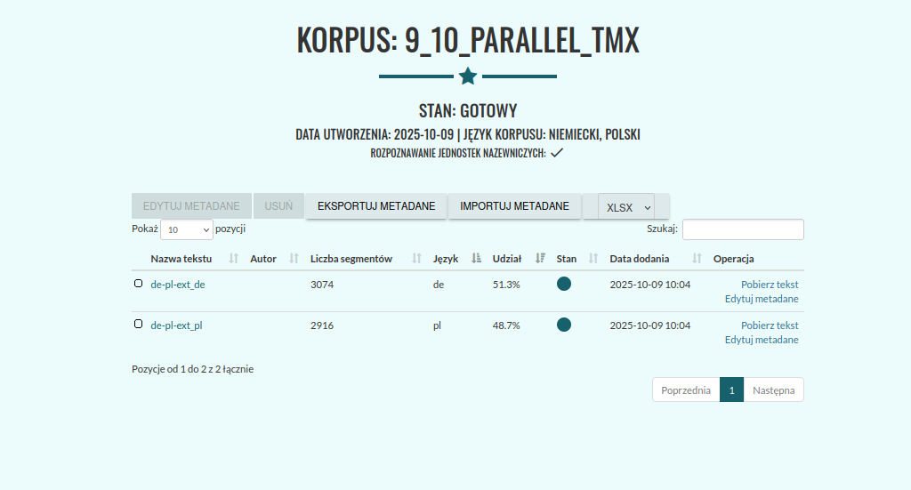
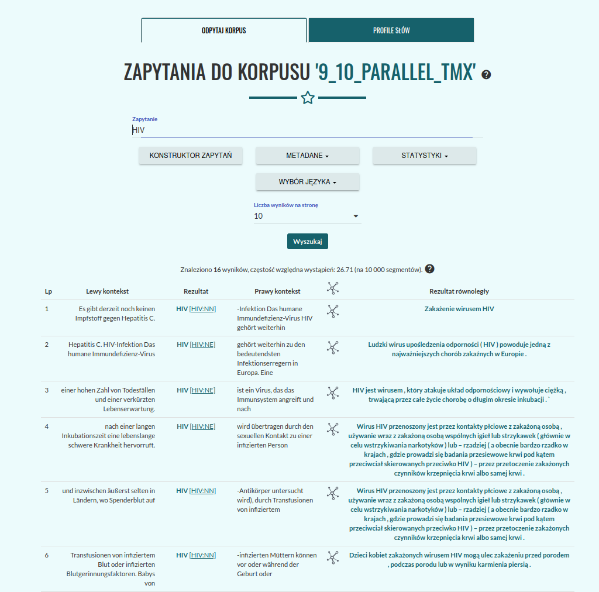

Korpusy równoległe
^^^^^^^^^^^^^^^^^^^^^^^^^^^^^^^

Korpusomat umożliwia tworzenie korpusów równoległych czyli takich, w których teksty w różnych językach są ze sobą powiązane
zdaniowo — każde zdanie w jednym języku odpowiada zdaniu (lub grupie zdań) w drugim języku.
Dzięki temu możliwe jest wyszukiwanie odpowiedników słów, zwrotów i konstrukcji między językami.

Obsługiwane formaty plików
==========================

Pliki z tekstami można dodać na dwa sposoby:

a) **plik TMX** 
- Zawiera już zdania sparowane w dwóch (lub więcej) językach.
Korpusomat automatycznie odczytuje te pary i zachowuje ich powiązanie.

b) **plik CSV**
- Każdy wiersz w pliku CSV odpowiada jednej parze (lub grupie) zdań w różnych językach.

- Przygotowanie pliku CSV dla korpusu równoległego:
  
  Pierwszy wiersz musi zawierać kody języków UTF-8 (np. pl, en, de) — to nagłówki kolumn.
  Każdy kolejny wiersz to jedno dopasowanie zdań — po jednym zdaniu w każdym języku.
  Przykład (dla dwóch języków: polskiego i angielskiego):

  .. code-block:: python

   pl,en
   Niestety nadal nie jest dostępna szczepionka przeciwko wirusowemu zapaleniu wątroby typu C.,Vaccination against hepatitis C is not yet available.
   Zakażenie wirusem HIV,HIV infection
   Ludzki wirus upośledzenia odporności (HIV) powoduje jedną z najważniejszych chorób zakaźnych w Europie.,The human immunodeficiency virus (HIV) remains one of the most important communicable diseases in Europe.

c) **Oddzielne pliki tekstowe TXT**
- Możliwe jest przesłanie dwóch osobnych plików tekstowych, po jednym dla każdego języka.
    - Pliki z wierszami odpowiadającymi sobie: każdy wiersz odpowiada jednemu zdaniu, a wiersze w obu plikach są sparowane.

    - Pliki z wierszami nieodpowiadającymi sobie: na przykład książka napisana w języku polskim oraz jej tłumaczenie na język angielski.
      Pliki nie mają powiązań między zdaniami. W takim przypadku dopasowanie zdań zostanie wykonane przez narzędzie **Hunalign**, które porównuje długość zdań i korzysta ze słowników dwujęzycznych, aby dopasować do siebie odpowiadające zdania w obu językach.

Instrukcja
==================

Podczas tworzenia korpusu należy zaznaczyć checkbox **Korpus równoległy** oraz określić języki dodawanych tekstów.

|image1|

Następnie należy wybrać zrównoleglony wcześniej plik (DODAJ TEXT ZRÓWNOLEGLONY (TMX)) lub osobne pliki tekstowe (DODAJ TEKSTY DO ZRÓWNOLEGLENIA)

|image2|
|image3|

Jeżeli w plikach, które dodajemy wiersz w jednym pliku odpowiada wierszowi w drugim pliku należy zaznaczyć checkbox **Wiersze w obu plikach odpowiadają sobie**.

|image4|
|image5|

Wskazówki dla najlepszych rezultatów
=====================================

Dla najdokładniejszego dopasowania używaj plików TMX lub plików, w których wiersze odpowiadają sobie.

Unikaj bardzo długich akapitów w jednym wierszu. Podział zdań poprawia dokładność dopasowania.

