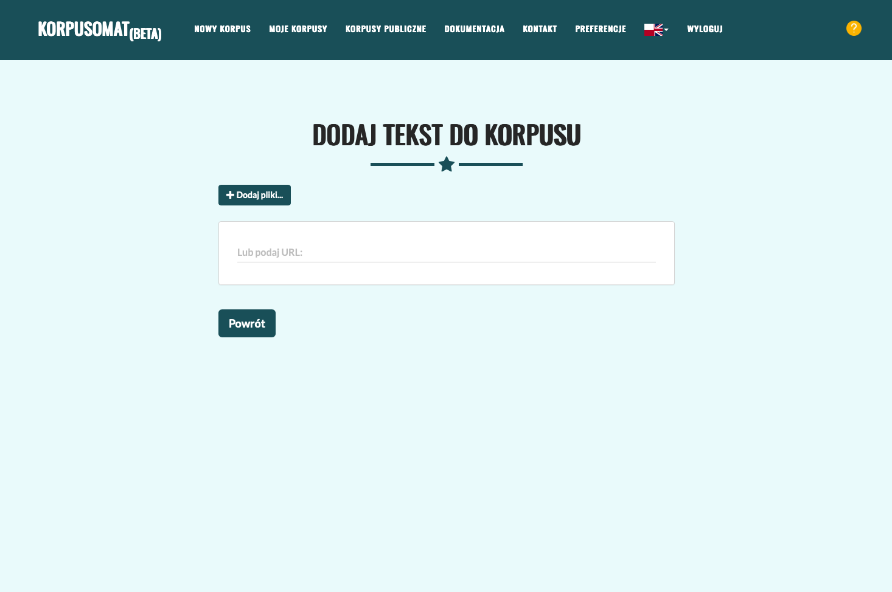
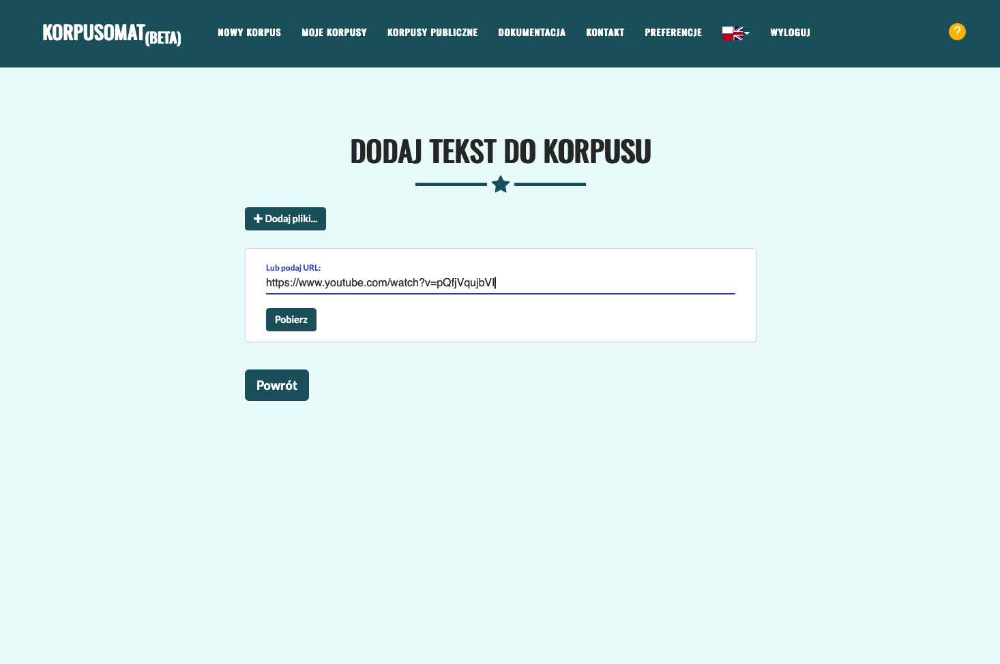
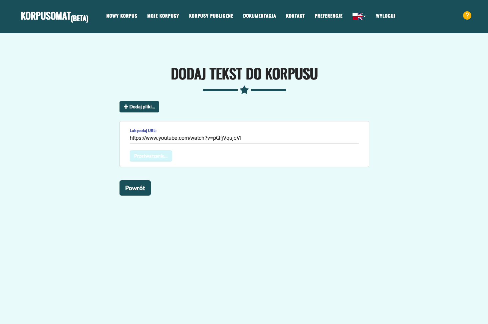
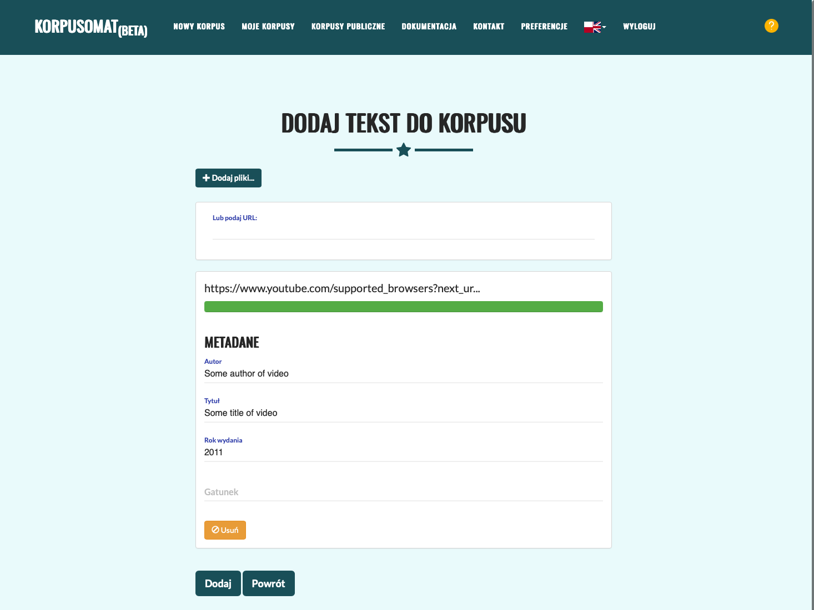
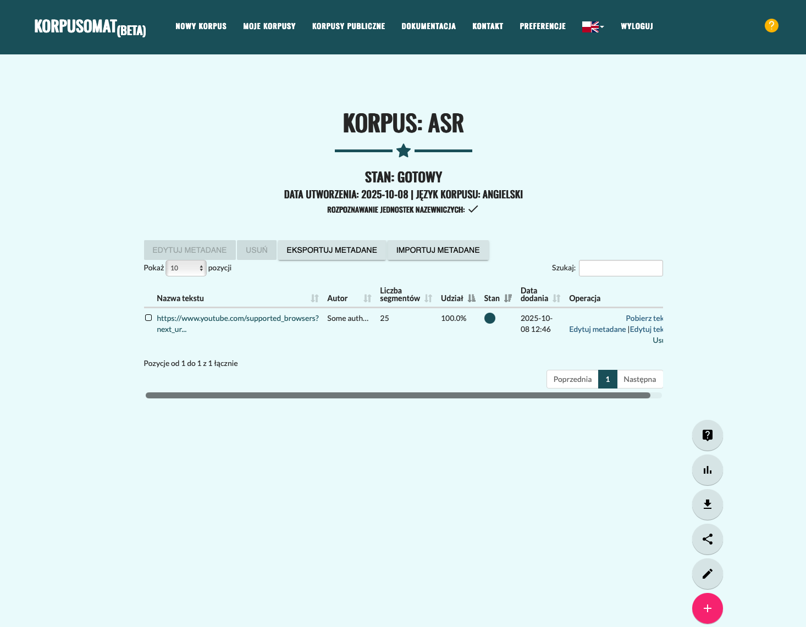
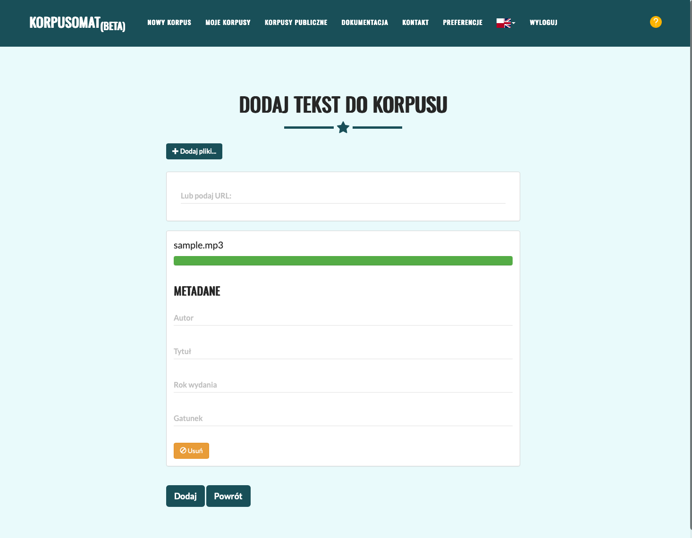
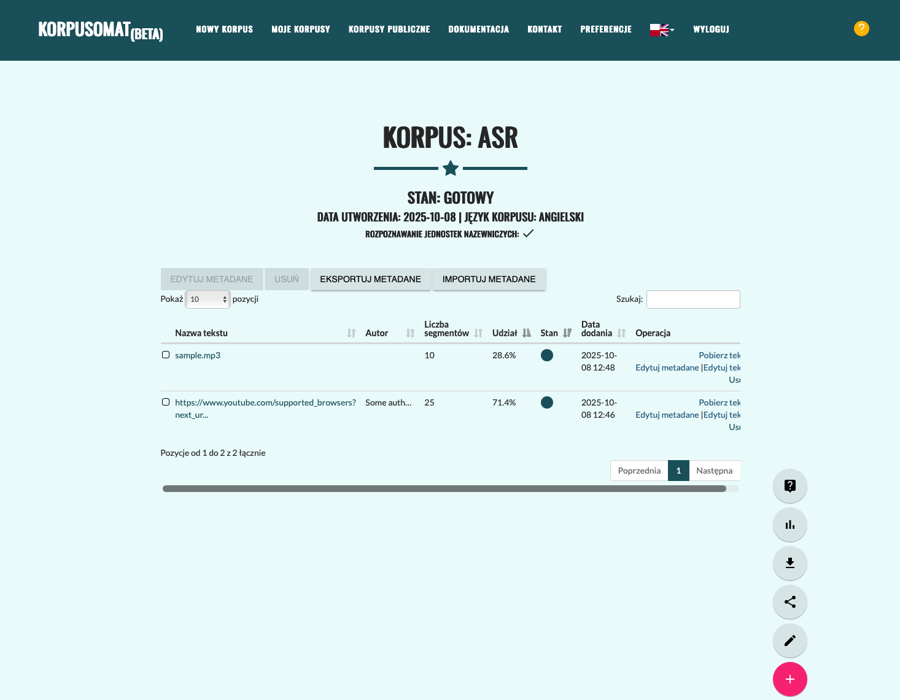
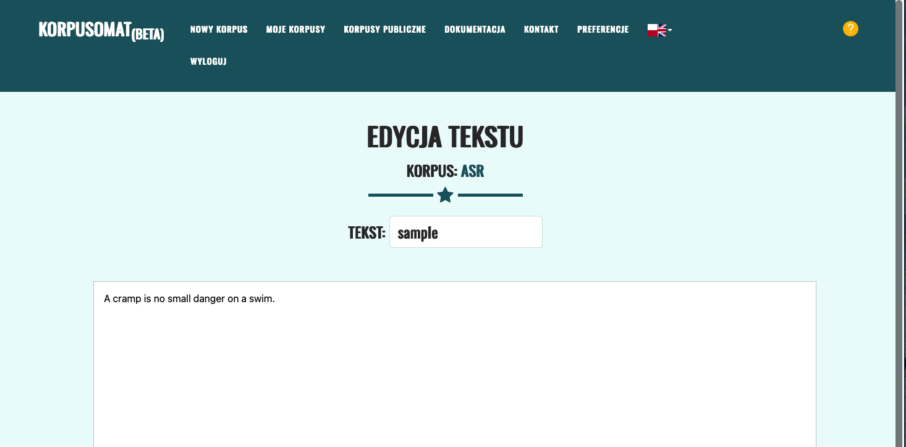

Mowa na tekst
^^^^^^^^^^^^^^^^^^^^^^^^^^^^^^^

Obsługiwane formaty
===================

Korpusomat umożliwia automatyczne transkrypcje nagrań audio i video do postaci tekstowej. System obsługuje następujące formaty plików:

* **.m4a** – format audio Apple (MPEG-4 Audio)
* **.wav** – format audio Waveform Audio File Format
* **.mp3** – format audio MPEG Audio Layer III
* **URL YouTube** – bezpośrednie przetwarzanie filmów z serwisu YouTube

Obsługiwane języki
==================

System automatycznie wykrywa język nagrania. Rozpoznawanie języka nie jest powiązane z językiem korpusu i działa niezależnie od jego ustawień.

Pełna lista obsługiwanych języków (100 języków):

.. list-table::
   :widths: 25 25 25 25
   :header-rows: 0

   * - English
     - Chinese
     - German
     - Spanish
   * - Russian
     - Korean
     - French
     - Japanese
   * - Portuguese
     - Turkish
     - Polish
     - Catalan
   * - Dutch
     - Arabic
     - Swedish
     - Italian
   * - Indonesian
     - Hindi
     - Finnish
     - Vietnamese
   * - Hebrew
     - Ukrainian
     - Greek
     - Malay
   * - Czech
     - Romanian
     - Danish
     - Hungarian
   * - Tamil
     - Norwegian
     - Thai
     - Urdu
   * - Croatian
     - Bulgarian
     - Lithuanian
     - Latin
   * - Maori
     - Malayalam
     - Welsh
     - Slovak
   * - Telugu
     - Persian
     - Latvian
     - Bengali
   * - Serbian
     - Azerbaijani
     - Slovenian
     - Kannada
   * - Estonian
     - Macedonian
     - Breton
     - Basque
   * - Icelandic
     - Armenian
     - Nepali
     - Mongolian
   * - Bosnian
     - Kazakh
     - Albanian
     - Swahili
   * - Galician
     - Marathi
     - Punjabi
     - Sinhala
   * - Khmer
     - Shona
     - Yoruba
     - Somali
   * - Afrikaans
     - Occitan
     - Georgian
     - Belarusian
   * - Tajik
     - Sindhi
     - Gujarati
     - Amharic
   * - Yiddish
     - Lao
     - Uzbek
     - Faroese
   * - Haitian creole
     - Pashto
     - Turkmen
     - Nynorsk
   * - Maltese
     - Sanskrit
     - Luxembourgish
     - Myanmar
   * - Tibetan
     - Tagalog
     - Malagasy
     - Assamese
   * - Tatar
     - Hawaiian
     - Lingala
     - Hausa
   * - Bashkir
     - Javanese
     - Sundanese
     - Cantonese

Instrukcja
==========

W pierwszej kolejności należy kliknąć przycisk **Pobierz**.

Następnie należy wypełnić pola metadanych. Niektóre z nich (tytuł, autor, data) mogą zostać automatycznie uzupełnione.

Po zakończeniu transkrypcji istnieje możliwość edycji tekstu poprzez kliknięcie przycisku **Edytuj tekst**.

