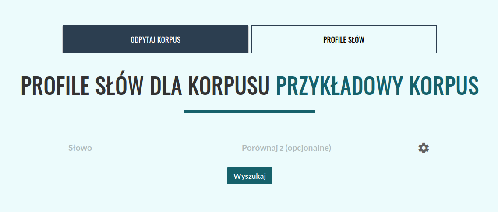
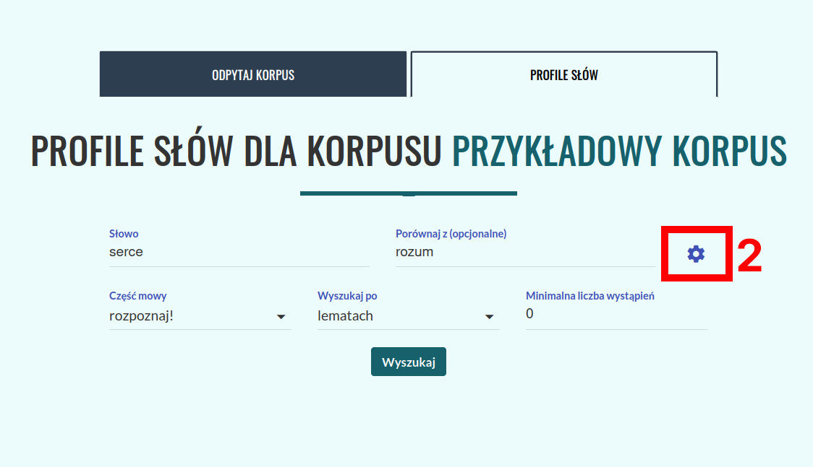
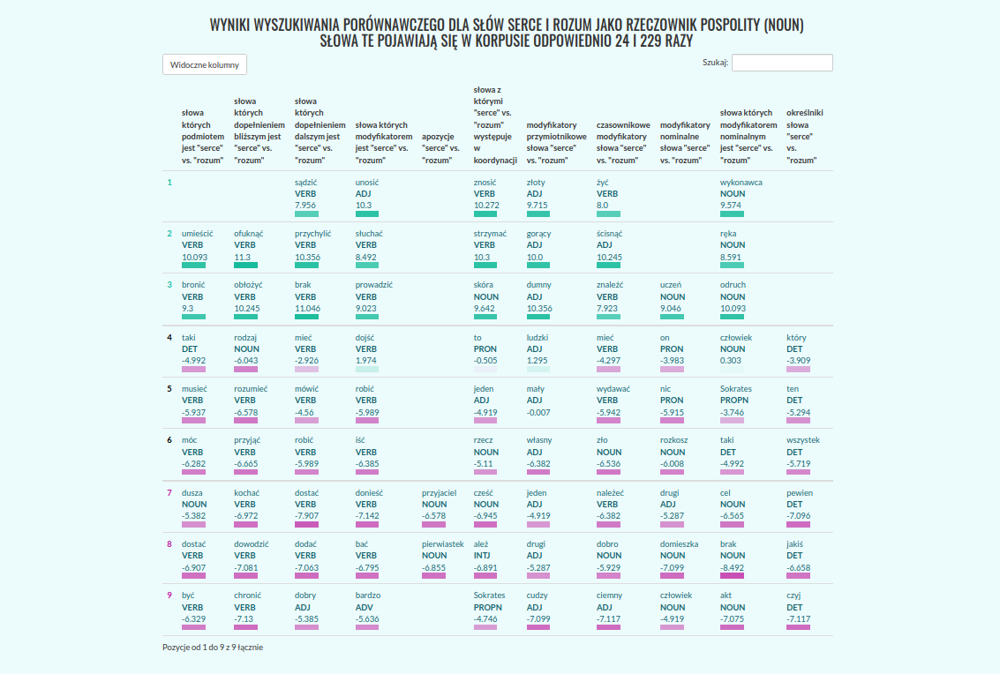

.. role:: lex
    :class: lex

Profile słów
^^^^^^^^^^^^

Wprowadzenie
============

Profile słów umożliwiają odnalezienie w tekście słownictwa, które często łączy się ze wskazanym słowem w związki syntaktyczne określonego rodzaju. Na przykład rzeczownik *oczy* często jest modyfikowany przez przymiotnik *niebieskie*, i często jest dopełnieniem bliższym czasownika *zamknąć*. Z kolei rzeczownik *pies* często pojawia się w związku koordynacji z rzeczownikiem *kot*. Otrzymane kolokacje charakteryzują język korpusu, tj. w korpusie reprezentatywnym dla standardowego języka polskiego, będą się głównie pojawiać związki wynikające z ogólnych zależności semantycznych lub frazeologii, natomiast w korpusie dziedzinowym, związki wywodzące się z języka danej dziedziny, związki charakteryzujące styl autora, lub jego sposób myślenia. Na przykład w korpusie ogólnym, słowo *funkcja* będzie często określane przymiotnikiem *podstawowa*, zaś w korpusie matematycznym, częściej pojawi się przymiotnik *ciągła* lub *różnowartościowa*. Można się też spodziewać, że przymiotnik *robotniczy*, będzie występował z innymi kolokatami w korpusie z czasów PRL, a z innymi w korpusie współczesnym.

.. note::
    Profile słów są dostępne wyłącznie dla korpusów posiadających warstwę anotacji zależnościowej.

    Należy zauważyć, że ze względów statystycznych funkcjonalność profili słów najlepiej działa dla korpusów stosunkowo dużych (od 1 miliona segmentów), oraz słów pojawiających się w danym korpusie relatywnie często.

    Obliczenie profilu danego słowa, może potrwać od kilku, do kilkudziesięciu sekund, w zależności od wielkości korpusu i częstości słowa.

Korzystanie
===========

|image29|

Profile słów są dostępne z poziomu ekranu *Odpytaj korpus*, karta *Profile Słów* (**1** na obrazku). W pole *Słowo* należy wpisać słowo, którego profil chcemy obliczyć. 

|image30|

Zaawansowane opcje wyszukiwania
-------------------------------

Po kliknięciu w ikonę koła zębatego (**2**) dostępne są również zaawansowane opcje wyszukiwania – tworząc profil danego słowa, możemy wybrać, czy interesują nas wszystkie jego wystąpienia, niezależnie od formy w tekście (i.e. szukamy po lemacie), czy też chcemy zobaczyć jedynie kolokaty określonej formy danego leksemu (np. rzeczownika *psy*, a więc słowa w liczbie mnogiej, i mianowniku lub bierniku). Możemy też odfiltrować kolokaty, ustawiając minimalną liczbę wspólnych wystąpień w korpusie, ta funkcja pozwala ominąć pary które nie powtarzają się, a uzyskały wysoki wynik ze względu na ich rzadkość w korpusie.

|image31|
      Formularz pozwalający doprecyzować parametry profilu słów: narzucić określoną interpretację pod względem klasy gramatycznej, określić czy interesują nas wystąpienia wskazanej formy, czy wszystkich form przynależących do danego leksemu, zastosować filtrowanie frekwencyjne, lub słowo kontrastowe.

W wyniku otrzymujemy tabelę, z której każda kolumna odpowiada jednemu z typów związków syntaktycznych w jakie może wchodzić wskazane słowo. Dane w każdej z kolumn reprezentują ranking kolokatów, każdy z takich rankingów jest niezależny od pozostałych.

.. note ::
   Domyślna wartość minimalnej liczby wystąpień kolokatów zależy od wielkości korpusu – dla korpusów mających co najmniej 100 tysięcy segmentów wynosi 3, natomiast dla mniejszych korpusów – 0. 

Profile porównawcze
-------------------
Aplikacja umożliwia także tworzenie profili porównawczych. W tym celu należy wpisać do pola *porównaj z* drugie z interesujących nas słów. Wyszukiwanie porównawcze zakłada, że zadane słowa należą do tej samej klasy gramatycznej. Przygotowując tabelę, aplikacja weźmie pod uwagę różnicę wartości **logDice** słowa podstawowego, oraz słowa porównawczego dla każdego z kolokatów. Tabela jest automatycznie skracana do postaci w której ekstrahowane są trzy sekcje. Kolokaty wyraźnie preferujące pierwsze słowo, kolokaty neutralne (o wartościach różnicy logDice najbliższych 0), oraz kolokaty wyraźnie preferujące słowo porównawcze. Indeksy wierszy wpadających do każdej z tych sekcji są oznaczone innym kolorem.
|image32|
      Tabela wynikowa, dla profilu porównawczego: *serce* vs. *rozum* w korpusie dialogów Platona.

Kliknięcie każdego z kolokatów, wygeneruje wyrażenie wyszukiwawcze które pozwoli odnaleźć wszystkie wspólne wystąpienia obu terminów w Korpusie.

Wykorzystane miary
==================

Profile słów przedstawiają słownictwo często współwystępujące ze wskazanym słowem. Znaczenie słowa *często*, jest tutaj formalizowane za pomocą miary **logDice** (i to te wartości są widoczne w tabeli). Miara ta przypisuje każdej z badanych par słów wynik będący w pewnym uproszczeniu stosunkiem liczby wystąpień w korpusie razem, do sumy wystąpień w korpusie w ogóle (razem lub osobno) każdego ze słów. W ten sposób odfiltrowujemy takie słowa, które pojawiają się obok słowa zadanego często, w wyniku tego że same są bardzo częste (np. czasownik *mieć*, w odróżnieniu od czasownika *zamykać*).

Miara **logDice**, w odróżnieniu od innych miar stosowanych do ekstrakcji kolokacji, jest interpretowalna: maksymalnie osiąga wartość 14 (gdy słowa współwystępują zawsze), zaś różnica między wartościami wielkości 1, oznacza że jedna z kolokacji jest dwukrotnie częstsza niż druga. Wartość logDice nie jest też zależna od wielkości korpusu (można więc porównywać wartości otrzymane dla różnych korpusów).

Podstawa lingwistyczna
======================

Profile słów są obliczane na podstawie anotacji morfologicznej i wyników parsowania zależnościowego, dlatego funkcja ta dostępna jest wyłącznie dla korpusów posiadających warstwę anotacji zależnościowej. Dla każdej z obsługiwanych części mowy przygotowano ręcznie zestaw reguł, pozwalających odnaleźć potencjalne kolokaty danego słowa. Na przykład dla rzeczowników, reguły odnajdują w korpusie czasowniki których dany rzeczownik jest podmiotem (*pracownik wykonuje*), dopełnieniem bliższym (*zwolnił pracownika*), lub rzeczowniki modyfikowane przez dany rzeczownik (*rynek pracownika*). Zestaw reguł jest domyślnie dobierany na podstawie klasy morfosyntaktycznej zadanego słowa, rozpoznanej przez aplikację automatycznie, natomiast możliwe jest także narzucenie określonej interpretacji (np. słowu *wieść* jako rzeczownik, a nie czasownik). W wykazie kolokacji wystąpienia pojawiają się w formie zlematyzowanej. 

|image27|
      W obliczaniu profili słów, wykorzystywane są drzewa zależnościowe, takie jak fragment przedstawiony na obrazku. Jeżeli interesuje nas słowo *serce*, do kolumny *przymiotniki modyfikujące "serce"* trafi słowo *mały*, zaś do kolumny *słowa których modyfikatorem nominalnym jest "serce"*, słowo *człowiek*.

Należy zwrócić uwagę na to, że kolokacje nie są liczone w sposób uwzględniający negacje. Wystąpienia danego słowa będą zaliczane w poczet tego samego kolkatu niezależnie od tego, czy są w zasięgu modyfikatorów negujących (np. słowo *nie*), spójników takich jak *ani*, modyfikatorów leksykalnych o charakterze zbliżonym do negacji (jak np. *mało* w *mało przystojny*), albo wreszcie same są formą zanegowaną (np. imiesłów *niepoinformowany*).

Związki koordynacji
-------------------

Jedną z najistotniejszych relacji które można wziąć pod uwagę, są związki o charakterze współrzędnym - koordynacja. W wykorzystanym formalizmie gramatycznym, koordynację reprezentuje się jako poddrzewo, którego głową jest pierwszy z członów koordynacji, zaś liśćmi - pozostałe człony. Głowa poddrzewa łączy się ze swoim nadrzędnikiem relacją, którą pełniłaby, gdyby występowała jako pojedyncze wyrażenie, natomiast pozostałe człony są oetykietowane relacjami *conj*. Ewentualne spójniki połączone są z liśćmi poddrzewa relacją *cc*. Na przykład w zdaniu *Czarny pies i kot śpią.* słowo *pies* łączy się z czasownikiem *śpią* relacją *nsubj*, słowo *kot* jest podrzędnikiem słowa *pies* i słowa te łączy relacja o etykiecie *conj*, natomiast *i* łączy się ze słowem *kot* jako spójnik łączący, przyjmuje więc etykietę *cc*, jak w poniższym przykładzie.

|image28|

Aby umożliwić rozpoznawanie słów występujących jako drugi lub kolejny człon koordynacji, w zastosowanym systemie ekstrakcji kolokatów traktujemy poddrzewa koordynacji w sposób szczególny. W ramach przeszukiwania drzewa niejako przeskakuje się przez pierwszy z członów koordynacji, czyli korzeń poddrzewa. Analizując wskazany wyżej przykład, w poczet podmiotów czasownika *spać* zostaną (a więc idąc w dół drzewa) zaliczone rzeczowniki *pies* i *kot*. Obliczając zaś listę czasowników, których podmiotem jest słowo *kot* (tj. idąc w górę drzewa), przejdziemy w drzewie dwa kroki, dzięki czemu zaliczymy wystąpienie czasownika *spać*.

Warto zaznaczyć, że mechanizmem tym objęte są jedynie niektóre z relacji. W powyższym przykładzie słowo *czarny* nie zostanie uwzględnione jako modyfikator przymiotnikowy słowa *kot*. Następujące relacje uwzględniają wyżej opisany mechanizm rozszerzania koordynacji:

* dla rzeczowników (NOUN/PROPN):

  * *słowa których podmiotem jest (...)*,

  * *słowa których dopełnieniem bliższym jest (...)*,

  * *słowa których dopełnieniem dalszym jest (...)*.

* dla czasowników (VERB):

  * *słowa które są podmiotem (...)*,

  * *słowa które są dopełnieniem bliższym (...)*,

  * *słowa które są dopełnieniem dalszym (...)*,

  * *słowa które są podmiotem zdaniowym (...)*,

  * *słowa których podmiotem zdaniowym jest (...)*,

  * *słowa które są dopełnieniem zdaniowym (...)*,

  * *słowa których dopełnieniem zdaniowym jest (...)*.

|image26|
   Reprezentacja koordynacji oraz negacji w zastosowanym formalizmie składniowym. Ponieważ bezpośrednim podrzędnikiem relacji *obj* jest pierwszy z członów koordynacji, słowo *charakter* zostanie włączone w poczet *dopełnień bliższych "objawiać"*. Podczas obliczeń przeskakujemy dodatkowo o poziom niżej po relacjach z etykietą *conj*, aby uwzględnić również słowo *stanowisko*.

.. |image28| image:: img/new_img/28.png
   :class: center-block
   :alt: Drzewo zależnościowe wyrażenia "Czarny pies i kot śpią."
.. |image29| image:: img/new_img/29.png
   :class: center-block
   :alt: Panel "odpytaj korpus", w którym znajduje się zakładka profili słów

