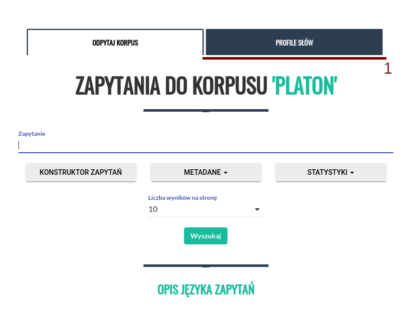
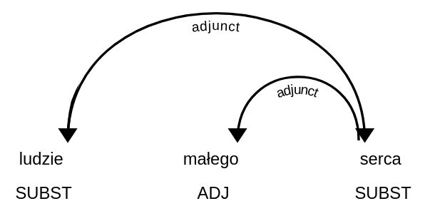
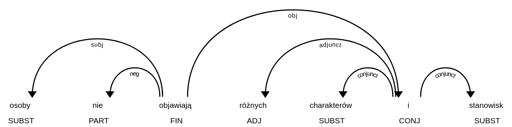
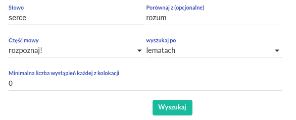
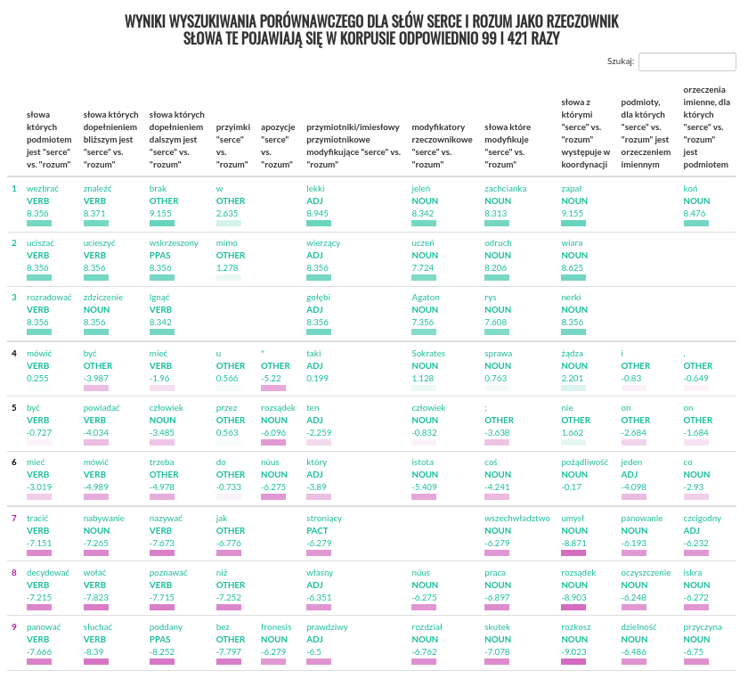

Profile słów
^^^^^^^^^^^^

Wprowadzenie
============

Profile słów polegają na odnalezieniu w tekście słownictwa, które często łączy się ze wskazanym słowem w związki syntaktyczne określonego rodzaju. Na przykład rzeczownik *oczy* często jest modyfikowany przez przymiotnik *niebieskie*, i często jest dopełnieniem bliższym czasownika *zamknąć*. Z kolei rzeczownik *pies* często pojawia się w związku koordynacji z rzeczownikiem *kot*. Otrzymane kolokacje charakteryzują język korpusu, tj. w korpusie reprezentatywnym dla standardowego języka polskiego, będą się głównie pojawiać związki wynikające z ogólnych zależności semantycznych lub frazeologii, natomiast w korpusie dziedzinowym, związki wywodzące się z języka danej dziedziny, związki charakteryzujące styl autora, lub jego sposób myślenia. Na przykład w korpusie ogólnym, słowo *funkcja* będzie często określane przymiotnikiem *podstawowa*, zaś w korpusie matematycznym, częściej pojawi się przymiotnik *ciągła* lub *różnowartościowa*. Można się też spodziewać, że przymiotnik *robotniczy*, będzie występował z innymi kolokatami w korpusie z czasów PRL, a z innymi w korpusie współczesnym.

.. note::
    Profile słów są dostępne wyłącznie dla korpusów posiadających warstwę anotacji zależnościowej.

    Należy zauważyć, że ze względów statystycznych funkcjonalność profili słów najlepiej działa dla korpusów stosunkowo dużych (od 1 miliona segmentów), oraz słów pojawiających się w danym korpusie relatywnie często.

    Obliczenie profilu danego słowa, może potrwać od kilku, do kilkudziesięciu sekund, w zależności od wielkości korpusu i częstości słowa.

Korzystanie
===========

|image14|

Profile słów są dostępne z poziomu ekranu *Odpytaj korpus*, karta *Profile Słów* (**1** na obrazku). W pole *Słowo* należy wpisać słowo, którego profil chcemy obliczyć. Tworząc profil danego słowa, możemy wybrać, czy interesują nas wszystkie jego wystąpienia, niezależnie od formy w tekście (i.e. szukamy po lemacie), czy też chcemy zobaczyć jedynie kolokaty określonej formy danego leksemu (np. rzeczownika *psy*, a więc słowa w liczbie mnogiej, i mianowniku lub bierniku). Możemy też odfiltrować kolokaty, ustawiając minimalną liczbę wspólnych wystąpień w korpusie, ta funkcja pozwala ominąć pary które nie powtarzają się, a uzyskały wysoki wynik ze względu na ich rzadkość w korpusie.

|image17|
      Formularz pozwalający doprecyzować parametry profilu słów: narzucić określoną interpretację pod względem klasy gramatycznej, określić czy interesują nas wystąpienia wskazanej formy, czy wszystkich form przynależących do danego leksemu, zastosować filtrowanie frekwencyjne, lub słowo kontrastowe.

W wyniku otrzymujemy tabelę, z której każda kolumna odpowiada jednemu z typów związków syntaktycznych w jakie może wchodzić wskazane słowo. Dane w każdej z kolumn reprezentują ranking kolokatów, każdy z takich rankingów jest niezależny od pozostałych, więc uporządkowanie danych w wiersze w tabeli, nie ma znaczenia.

Aplikacja umożliwia także tworzenie profili porównawczych. W tym celu należy wpisać do pola *porównaj z* drugie z interesujących nas słów. Przygotowując tabelę, aplikacja weźmie pod uwagę różnicę wartości **logDice** słowa podstawowego, oraz słowa porównawczego dla każdego z kolokatów. Tabela jest automatycznie skracana do postaci w której ekstrahowane są trzy sekcje: kolokaty wyraźnie preferujące pierwsze słowo, kolokaty neutralne (o wartościach różnicy logDice najbliższych 0), oraz kolokaty wyraźnie preferujące słowo porównawcze. Indeksy wierszy wpadających do każdej z tych sekcji są oznaczone innym kolorem.

|image18|
      Tabela wynikowa, dla profilu porównawczego: *serce* vs. *rozum* w korpusie dialogów Platona.

Kliknięcie każdego z kolokatów, wygeneruje wyrażenie wyszukiwawcze które pozwoli odnaleźć wszystkie wspólne wystąpienia obu terminów w Korpusie.

Wykorzystane miary
====================

Profile słów przedstawiają słownictwo często współwystępujące ze wskazanym słowem. Znaczenie słowa *często*, jest tutaj formalizowane za pomocą miary **logDice** (i to te wartości są widoczne w tabeli). Miara ta przypisuje każdej z badanych par słów wynik będący w pewnym uproszczeniu stosunkiem liczby wystąpień w korpusie razem, do sumy wystąpień w korpusie w ogóle (razem lub osobno) każdego ze słów. W ten sposób odfiltrowujemy takie słowa, które pojawiają się obok słowa zadanego często, w wyniku tego że same są bardzo częste (np. czasownik *mieć*, w odróżnieniu od czasownika *zamykać*).

Miara **logDice**, w odróżnieniu od innych miar stosowanych do ekstrakcji kolokacji, jest interpretowalna: maksymalnie osiąga wartość 14 (gdy słowa współwystępują zawsze), zaś różnica między wartościami wielkości 1, oznacza że jedna z kolokacji jest dwukrotnie częstsza niż druga. Wartość logDice nie jest też zależna od wielkości korpusu (można więc porównywać wartości otrzymane dla różnych korpusów).

Podstawa lingwistyczna
=============================

Profile słów są obliczane na podstawie anotacji morfologicznej, i wyników parsowania zależnościowego, jest więc funkcją dostępną wyłącznie dla korpusów posiadających warstwę anotacji zależnościowej. Dla każdej z obsługiwanych części mowy (rzeczowniki, czasowniki, przymiotniki, przysłówki, imiesłowy przymiotnikowe czynne oraz bierne i przysłówkowe uprzednie oraz współczesne) przygotowano ręcznie zestaw reguł, pozwalających odnaleźć potencjalne kolokaty danego słowa. Na przykład dla rzeczowników, reguły odnajdują w korpusie czasowniki których dany rzeczownik jest podmiotem (*pracownik wykonuje*), dopełnieniem bliższym (*zwolnił pracownika*), lub rzeczowniki modyfikowane przez dany rzeczownik (*rynek pracownika*). Zestaw reguł jest domyślnie dobierany na podstawie klasy morfosyntaktycznej zadanego słowa, rozpoznanej przez aplikację automatycznie, natomiast możliwe jest także narzucenie określonej interpretacji (np. słowu *wieść* jako rzeczownik, a nie czasownik).

|image15|
      W obliczaniu profili słów, wykorzystywane są drzewa zależnościowe, takie jak fragment przedstawiony na obrazku. Jeżeli interesuje nas słowo *serce*, do kolumny *przymiotniki modyfikujące "serce"* trafi słowo *mały*, zaś do kolumny *rzeczowniki modyfikowane przez "serce"*, słowo *człowiek*.

W wykazie kolokacji, wystąpienia pojawiają się w formie zlematyzowanej, jednak stosujemy tu inne zasady lematyzacji, niż te, których wyniki są zapisane w plikach korpusu (i dostępne dla odpytywania korpusu), w szczególności imiesłowy oraz gerundia nie są lematyzowane do form czasownikowych.

Jedną z najistotniejszych relacji które można wziąć pod uwagę, są związki o charakterze współrzędnym - koordynacja. W wykorzystanym formalizmie gramatycznym, koordynację reprezentuje się jako poddrzewo, którego głową jest spójnik, zaś liścmi człony koordynacji. Te ostatnie są oetykietowane relacjami *conjunct*, zaś sam spójnik łączy się ze swoim nadrzędnikiem relacją, którą pełniłby każdy z członów gdyby wystąpił osobno. Na przykład w zdaniu *Pies i kot śpią.* słowa *Pies* oraz *kot* są podrzędnikami spójnika *i*, jako człony koordynacji mają więc etykiety *conjunct*, podczas gdy spójnik *i* przyjmuje etykietę *subj*, tak jakby to spójnik (a tak naprawdę cała konstrukcja) pełnił rolę podmiotu, względem czasownika *śpią*. W naszym systemie ekstrakcji kolokatów, traktujemy spójniki koordynujące w sposób szczególny, niejako przeskakując przez nie w drzewie. Analizując wskazany wyżej przykład, w poczet podmiotów czasownika *spać* (a więc idąc w dół drzewa) nie zostanie zaliczony spójnik *i* (jak trzeba by zrobić aplikując reguły do drzewa takiego, jakim jest) tylko wszystkie człony które koordynuje, i.e. *pies* oraz *kot*. Obliczając zaś listę czasowników których podmiotem jest słowo *pies* (tj. idąc w górę drzewa), przejdziemy w drzewie dwa kroki, zaliczając wystąpienie czasownika *spać* zamiast pomijać go.

Należy zwrócić uwagę na to, że kolokacje nie są liczone w sposób uwzględniający negacje. Wystąpienia danego słowa, będą zaliczane w poczet tego samego kolokatu niezależnie od tego, czy są w zasięgu słowa *nie*, spójnika takiego jak *ani*, modyfikatora o leksykalnym charakterze zbliżonym do negacji (jak np. *mało* w *mało przystojny*), albo wreszcie same są formą zanegowaną (np. imiesłów *niepoinformowany*).

|image16|
      Reprezentacja koordynacji, oraz negacji, w zastosowanym formalizmie składniowym. Ponieważ bezpośrednim podrzędnikiem relacji *obj* jest spójnik *i*, podczas obliczeń, przeskakujemy o poziom niżej, po relacjach z etykietą *conjunct*, aby zaliczyć w poczet *dopełnień bliższych "objawiać"* słowa *charakter* i *stanowisko*, zamiast słowa *i*. Profile słów nie są wrażliwe na to, czy więc we wskazanym przykładzie, licząc profil słowa *osoba*, czasownik *objawiać* trafi do kolumny *czasowniki których podmiotem jest "osoba"*.

